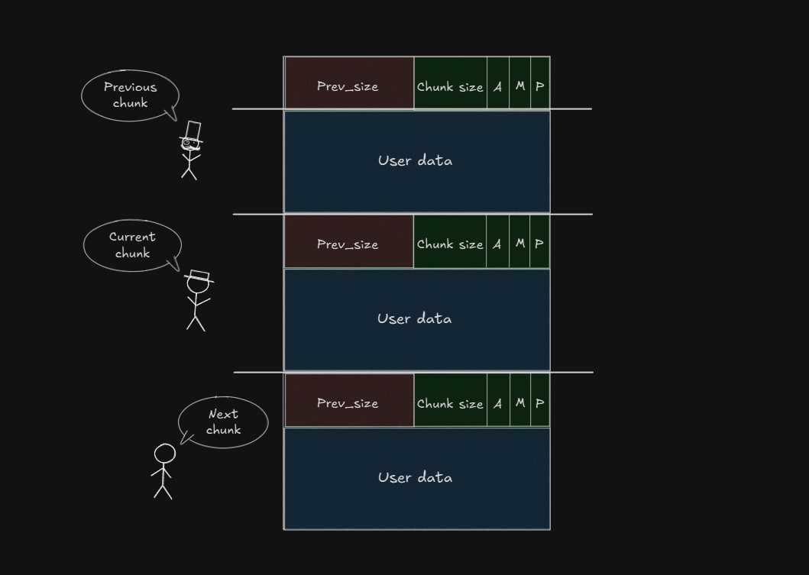
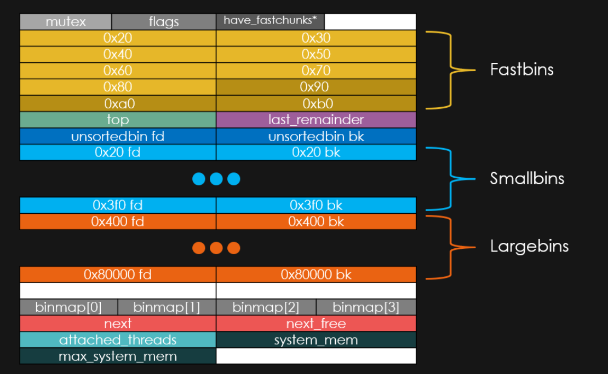

import Callout from '@/components/Callout.astro'

## Prologue

When I first started learning about how memory works, I didn’t have a clear goal. I was just curious—wondering what really happens when a program asks for memory, uses it, and then gives it back.

That curiosity led me to the heap. At the beginning, everything felt a bit vague and confusing. But the more I read and explored, the more things started to make sense. I began to notice patterns, understand how memory is managed, and realize that the heap isn’t just a space for data—it’s a system. One that can be smart, complex, and sometimes easy to break if you know how.

That brings us to this series — Heap Exploitation. This isn’t a perfect guide or a complete blog. It’s more like a learning journal: a place where I write down what I’ve learned, what I’m still trying to understand, and what I wish I had known earlier. So, I'm sharing it in the hope that it might help someone else who’s also starting out, or just curious like I was.

I’ll keep updating it over time as I learn more and get better at explaining things. Think of it as a work-in-progress — something that grows along with my journey. So if there is any mistake please DM me via [discord](https://discord.com/users/590715913939189765), I will research and fix it as soon as possible.

And if you’re also someone who learns by exploring and asking `how does this really work?`, then welcome. Let’s go through the heap together.

## Overview

Memory is part of how everything works in every program. Each time a program is run, it must allocate memory to store data, variables, and other information. This is generally subdivided into different areas, and two of its most fundamental ones are the stack and the heap.

Maybe you have used the stack—it is a box into which you stack up objects and unstack them in order. It is fast and convenient but restrictive. The heap is a different kind of area in memory. It is more flexible. The program may request memory from the heap at runtime and keep it as long as it needs.

It is this flexibility that renders the heap such a handy resource, especially for programs that handle much data or have little idea how much space they will need when they start. More control, though, means more risk. Memory on the heap is more difficult to handle. When not adequately controlled, unmanaged memory creates problems like crashes, slowdowns, or even serious security risks.

According to many sources, heap-related bugs play a big role in real-world exploitation. Therefore, learning how heaps work is not only cool—it's worth knowing if you want to create more secure, improved apps or even want to learn how various forms of exploits take place.

Throughout this series, we will talk about how the heap is built, how memory is allocated and released via functions such as malloc and free, and how an attacker would exploit vulnerabilities in the system. We will take it step by step, starting with basics and progressing on to some techniques in heap exploitation (possibly in CTF context). There is no rush—let us do this step by step.

## Lab Environment

To make it easier to test sample code or try things out for yourself, I’ve created a Docker environment. You can download it here:
<a href="/public/HeapExploitation/Part1/lab-env.zip" download="lab-env.zip" style={{ textDecoration: 'none', color: 'white' }}>
  <button style={{ padding: '10px 16px', fontSize: '1rem', cursor: 'pointer' }}>
    📦 Download Docker Environment
  </button>
</a>

The environment is based on `Ubuntu 18.04` with `GLIBC 2.27`. I choose this version because it’s a good for learning and getting familiar with how the heap works. It’s not the latest version, but it’s stable and widely used. I also included `pwndbg` for debugging, which is a great tool for analyzing memory and understanding how things work under the hood.

After downloading the zip file, just follow these steps:

1. Run the script: `setup_pwndbg.sh`

2. Then run: `run.sh`

Feel free to customize the environment to fit your own setup or experiments.

## Heap Structure

When I first learned about the heap, I imagined it as just a large block of memory where data gets stored when needed. But the more I explored, the more I realized that it’s not random at all—it’s actually a well-organized system with its own layout and rules.

Each time a program calls `malloc` or `free`, it’s interacting with this structure. The allocator needs to know which parts of memory are free, which are used, and how to manage everything quickly and safely.

Let’s explore how the heap is organized. We’ll look at how memory is divided into chunks, how those chunks are tracked, and how the heap grows when needed. This is the foundation that will help us understand not just how programs work with memory, but also how attackers can take advantage of it.

Once you understand the structure, a lot of things that seem like “magic” will start to make sense.

### Chunk

#### Overview

A chunk is the name given to a block of memory that is managed by the heap. When you call the malloc function, the memory you get back actually comes from a chunk.

Each chunk is a small part of the heap and follows a specific structure. This structure helps the allocator know how big the chunk is, whether it's in use or free, and where the next chunk is.

In memory, a chunk isn’t just raw space—it includes metadata that the allocator uses to manage things properly. This metadata is stored along with the chunk itself, just before the area that your program uses.

Here’s what a basic chunk structure looks like:

```c title="malloc.c:1060-1071" caption="malloc chunk structure" collapse={9-11}
struct malloc_chunk {

  INTERNAL_SIZE_T      mchunk_prev_size;  /* Size of previous chunk (if free).  */
  INTERNAL_SIZE_T      mchunk_size;       /* Size in bytes, including overhead. */

  struct malloc_chunk* fd;         /* double links -- used only if free. */
  struct malloc_chunk* bk;

  /* Only used for large blocks: pointer to next larger size.  */
  struct malloc_chunk* fd_nextsize; /* double links -- used only if free. */
  struct malloc_chunk* bk_nextsize;
};
```

To keep things simple and avoid confusion, I’ve left out the last two fields in the `malloc_chunk` structure. But for now, you only need to focus on the four most important parts:

- `prev_size` – the size of the previous chunk (used when it’s free)

- `chunk_size` – the size of the current chunk, including some flags

- `fd` – forward pointer (used when the chunk is free and part of a bin)

- `bk` – backward pointer (also used in bins for linking chunks)

These four fields play a key role in how the heap keeps track of memory and manages free chunks. Don’t worry if they sound a bit abstract right now—we’ll go over each one in more detail shortly.
you can see how they actually work in practice.

Also, you can take a look at the image below to get a better idea of what a chunk looks like in memory and how these fields are laid out.



From the image above, we can see that a chunk consists of two main parts: `metadata` and user `data`.

The metadata (aka chunk header) part contains information used by the memory allocator, such as `prev_size` and `size`. These fields are not part of the memory you directly use in your program—they're used internally to keep track of the chunk's size, status, and position in the heap.

In addition, we can also see that the heap grows upward in memory. This means that each new chunk is placed after the previous one, following a continuous order. Older chunks remain at lower memory addresses, while newer chunks are added at higher addresses.

But wait!! Earlier we saw that a `malloc_chunk` includes both `fd` and `bk` pointers. So why aren’t they shown in the image above? The answer is those fields only become relevant when a chunk is freed.

When a chunk is in use (allocated), the space where `fd` and `bk` would normally be is part of the user data. But once the chunk is freed, that space is reused by the allocator to store `fd` (forward pointer) and `bk` (backward pointer), which are used to link free chunks together in bins.

So if you’re looking at an allocated chunk in memory, you won’t see `fd` and `bk` but they’ll show up once the chunk is no longer in use.

We can look at the image below to easily visualize what a free chunk will look like:


We will see that there will be two more things appearing, `fd` (forward pointer) and `bk` (backward pointer). As the name suggests, these two pointers will point to the previous and next chunks in the free list (I will explain this more clearly when we get to the bins section).

#### Size bits

```c title="malloc.c:1272-1279" caption="Size bits
/*
   Bits to mask off when extracting size

   Note: IS_MMAPPED is intentionally not masked off from size field in
   macros for which mmapped chunks should never be seen. This should
   cause helpful core dumps to occur if it is tried by accident by
   people extending or adapting this malloc.
 */
#define SIZE_BITS (PREV_INUSE | IS_MMAPPED | NON_MAIN_ARENA)
```

We can see in the chunk layout image above that there are letters like `A`, `M`, and `P` shown next to the size field. These letters represent internal flags that are stored inside the chunk’s size value. They’re not part of the actual size but are packed into the same field for efficiency. This is where `SIZE_BITS` comes in.
`SIZE_BITS` is a bitmask used to mark which bits in the chunk’s size field are reserved for internal flags. These flags help the allocator keep track of extra information about the chunk.

When you want to get the real size of a chunk (excluding the flags), you need to perform a bitwise AND (&) between the chunk’s size and the inverse of SIZE_BITS. This operation clears the flag bits and leaves you with just the actual size.

The flags stored inside the size field include:

- `PREV_INUSE` (`P` - `0x1`): This bit tells whether the previous chunk is currently in use.

- `IS_MMAPPED` (`M`- `0x2`): Indicates whether this chunk was allocated using mmap instead of the heap.

- `NON_MAIN_ARENA` (`A` - `0x4`): Marks whether the chunk is part of a non-main arena, which can happen in multi-threaded programs.

These flags are packed into the same field as the chunk size, so we have to remove them first before we can get the real size value.

#### Demo

And to understand better, we will go into the following demo. We will have the source code as follows, copy it and compile it in the Docker environment I left above.

```c title="demo.c"
// gcc demo.c -no-pie -o demo -g
#include <stdio.h>
#include <stdlib.h>
#include <string.h>

int main()
{
    char *ptr1 = malloc(0x20);  // <-------- Chunk size will be 0x30 (0x10 metadata)
    char *ptr2 = malloc(0x200);
    char *ptr3 = malloc(0x2000);
    char *ptr4 = malloc(0x20000);

    strcpy(ptr1, "Hello World");

    return 0;
}
```

Debug it in `gdb` and set a breakpoint at the `malloc` function. You can do this by running the following command in the terminal:

```bash
pwndbg> bp *main+13
pwndbg> run
pwndbg> vmmap
LEGEND: STACK | HEAP | CODE | DATA | RWX | RODATA
             Start                End Perm     Size Offset File
          0x400000           0x401000 r-xp     1000      0 /root/demo
          0x600000           0x601000 r--p     1000      0 /root/demo
          0x601000           0x602000 rw-p     1000   1000 /root/demo
    0x7ffff79e2000     0x7ffff7bc9000 r-xp   1e7000      0 /lib/x86_64-linux-gnu/libc-2.27.so
    0x7ffff7bc9000     0x7ffff7dc9000 ---p   200000 1e7000 /lib/x86_64-linux-gnu/libc-2.27.so
    0x7ffff7dc9000     0x7ffff7dcd000 r--p     4000 1e7000 /lib/x86_64-linux-gnu/libc-2.27.so
    0x7ffff7dcd000     0x7ffff7dcf000 rw-p     2000 1eb000 /lib/x86_64-linux-gnu/libc-2.27.so
    0x7ffff7dcf000     0x7ffff7dd3000 rw-p     4000      0 [anon_7ffff7dcf]
    0x7ffff7dd3000     0x7ffff7dfc000 r-xp    29000      0 /lib/x86_64-linux-gnu/ld-2.27.so
    0x7ffff7fee000     0x7ffff7ff0000 rw-p     2000      0 [anon_7ffff7fee]
    0x7ffff7ff6000     0x7ffff7ffa000 r--p     4000      0 [vvar]
    0x7ffff7ffa000     0x7ffff7ffc000 r-xp     2000      0 [vdso]
    0x7ffff7ffc000     0x7ffff7ffd000 r--p     1000  29000 /lib/x86_64-linux-gnu/ld-2.27.so
    0x7ffff7ffd000     0x7ffff7ffe000 rw-p     1000  2a000 /lib/x86_64-linux-gnu/ld-2.27.so
    0x7ffff7ffe000     0x7ffff7fff000 rw-p     1000      0 [anon_7ffff7ffe]
    0x7ffffffde000     0x7ffffffff000 rw-p    21000      0 [stack]
0xffffffffff600000 0xffffffffff601000 r-xp     1000      0 [vsyscall]
```

We see that before `malloc` is executed for the first time, there is no such thing as a `heap`. Because as mentioned before, the heap only really appears when we execute `malloc` for the first time. Don't worry about this, because I will explain how malloc works in the next section `How malloc and free work`. For now, just know that, before `malloc` is executed for the first time, there is no such thing as a heap.

`malloc` for the first time:

```bash
pwndbg> vis
0x602250        0x0000000000000000      0x0000000000000031      ........1.......
0x602260        0x0000000000000000      0x0000000000000000      ................
0x602270        0x0000000000000000      0x0000000000000000      ................
0x602280        0x0000000000000000      0x0000000000020d81      ................         <-- Top chunk
pwndbg> vmmap
LEGEND: STACK | HEAP | CODE | DATA | RWX | RODATA
             Start                End Perm     Size Offset File
          0x400000           0x401000 r-xp     1000      0 /root/demo
          0x600000           0x601000 r--p     1000      0 /root/demo
          0x601000           0x602000 rw-p     1000   1000 /root/demo
          0x602000           0x623000 rw-p    21000      0 [heap]
    0x7ffff79e2000     0x7ffff7bc9000 r-xp   1e7000      0 /lib/x86_64-linux-gnu/libc-2.27.so
    0x7ffff7bc9000     0x7ffff7dc9000 ---p   200000 1e7000 /lib/x86_64-linux-gnu/libc-2.27.so
    0x7ffff7dc9000     0x7ffff7dcd000 r--p     4000 1e7000 /lib/x86_64-linux-gnu/libc-2.27.so
    0x7ffff7dcd000     0x7ffff7dcf000 rw-p     2000 1eb000 /lib/x86_64-linux-gnu/libc-2.27.so
    0x7ffff7dcf000     0x7ffff7dd3000 rw-p     4000      0 [anon_7ffff7dcf]
    0x7ffff7dd3000     0x7ffff7dfc000 r-xp    29000      0 /lib/x86_64-linux-gnu/ld-2.27.so
    0x7ffff7fee000     0x7ffff7ff0000 rw-p     2000      0 [anon_7ffff7fee]
    0x7ffff7ff6000     0x7ffff7ffa000 r--p     4000      0 [vvar]
    0x7ffff7ffa000     0x7ffff7ffc000 r-xp     2000      0 [vdso]
    0x7ffff7ffc000     0x7ffff7ffd000 r--p     1000  29000 /lib/x86_64-linux-gnu/ld-2.27.so
    0x7ffff7ffd000     0x7ffff7ffe000 rw-p     1000  2a000 /lib/x86_64-linux-gnu/ld-2.27.so
    0x7ffff7ffe000     0x7ffff7fff000 rw-p     1000      0 [anon_7ffff7ffe]
    0x7ffffffde000     0x7ffffffff000 rw-p    21000      0 [stack]
0xffffffffff600000 0xffffffffff601000 r-xp     1000      0 [vsyscall]
```
After malloc the heap appears and so on for subsequent mallocs new chunks will be allocated but if you pay attention to the `malloc(0x20000)` you will not see it when using the `vis` command. That is because the requested size is too large and `malloc` cannot extract a part from `topchunk` (I will explain about topchunk later), so it used vmmap to allocate that memory, and that memory will definitely have bit `2` turned on

### Top chunk

**Top chunk** (known as the **topmost available chunk**) is essentially a large heap chunk that holds currently unallocated data. After a new arena is initialized a top chunk always exists and there is only ever one per arena. For example, when you call `malloc(0x10)` (which means you want 16 bytes of memory), and it's the first time using `malloc`, the heap is not ready yet. So, `malloc` asks the operating system (kernel) for a much bigger block of memory, up to `0x21000`. This is more efficient than asking for memory every time. From that large block, `malloc` gives you 16 bytes plus some extra bytes for its own tracking (called metadata). The rest of the unused memory is saved in something called the **top chunk**, which is a special area that holds free memory. This top chunk is not in the free list (also called the bin list), but it's ready to be used for future `malloc` calls.

Each time you request memory, a small part of the top chunk is used, so the top chunk becomes smaller and smaller over time. When the top chunk is too small to give you the memory you asked for (and your request is smaller than the `mmap` threshold - **`mmap`** limit), `malloc` tries to grow the heap using a function called `sysmalloc()`. If this works, the top chunk is made bigger. But if it fails, a **new heap is created**, and its **top chunk becomes the new top chunk** of the **same arena**. The memory left in the old top chunk is then freed and can be reused. To protect against bugs when chunks are merged, `malloc` adds two fake chunks (called **fenceposts**) of size 0x10 at the end of the heap. These help stop the program from reading outside the heap by mistake. The top chunk’s size field shows how much space is left, and its `prev_inuse` bit is always set. This chunk is always big enough to give out the smallest allowed chunk, and it always ends exactly at the end of a memory page.

So let's get see an example to proof that the top chunk is expended when we request a large chunk that out of the topchunk size.

```c title="topchunk.c"
// gcc -o topchunk topchunk.c -g
#include <stdio.h>
#include <stdlib.h>
#include <unistd.h>


int main() {
    void *a, *b, *c;

    a = malloc(0x10);
    b = malloc(0x20000);
    c = malloc(0x10000);

    return 0;
}
```

The above code will allocate three chunks, the first one is small and the second one is large. The third one is also large but smaller than the second one. So let's see what happens when we run it in `gdb`.

```sh title="GDB"
pwndbg> top-chunk
Top chunk | PREV_INUSE
Addr: 0x5555555792c0
Size: 0xd40 (with flag bits: 0xd41)
```

There's nothing special about two allocated chunks, but the third one is interesting. The `top chunk` is now `0xd40` bytes, which means it has been extended to accommodate the large allocation.

```sh title="GDB"
pwndbg> heap
Allocated chunk | PREV_INUSE
Addr: 0x555555559000
Size: 0x290 (with flag bits: 0x291)

Allocated chunk | PREV_INUSE
Addr: 0x555555559290
Size: 0x20 (with flag bits: 0x21)

Allocated chunk | PREV_INUSE
Addr: 0x5555555592b0
Size: 0x20010 (with flag bits: 0x20011)

Allocated chunk | PREV_INUSE
Addr: 0x5555555792c0
Size: 0x10010 (with flag bits: 0x10011)

Top chunk | PREV_INUSE
Addr: 0x5555555892d0
Size: 0x20d30 (with flag bits: 0x20d31)
```

The `heap` command shows the allocated chunks and their sizes. The first two chunks are small, but the last two are large. The `top chunk` is now `0x20d30` bytes, which means it has been extended to accommodate the large allocation. Moreover, when we trace it using `strace`, we can see it use `brk()` syscall to extend the heap size.

```sh title="strace" collapse={1-36}
alter ^ Sol in /mnt/e/sec/HeapExploitation/heapexp_series
$ strace ./topchunk
execve("./topchunk", ["./topchunk"], 0x7ffea17a4fd0 /* 30 vars */) = 0
brk(NULL)                               = 0x562f59d09000
arch_prctl(0x3001 /* ARCH_??? */, 0x7ffc3b36fad0) = -1 EINVAL (Invalid argument)
mmap(NULL, 8192, PROT_READ|PROT_WRITE, MAP_PRIVATE|MAP_ANONYMOUS, -1, 0) = 0x7f9d0f519000
access("/etc/ld.so.preload", R_OK)      = -1 ENOENT (No such file or directory)
openat(AT_FDCWD, "/etc/ld.so.cache", O_RDONLY|O_CLOEXEC) = 3
newfstatat(3, "", {st_mode=S_IFREG|0644, st_size=63839, ...}, AT_EMPTY_PATH) = 0
mmap(NULL, 63839, PROT_READ, MAP_PRIVATE, 3, 0) = 0x7f9d0f509000
close(3)                                = 0
openat(AT_FDCWD, "/lib/x86_64-linux-gnu/libc.so.6", O_RDONLY|O_CLOEXEC) = 3
read(3, "\177ELF\2\1\1\3\0\0\0\0\0\0\0\0\3\0>\0\1\0\0\0P\237\2\0\0\0\0\0"..., 832) = 832
pread64(3, "\6\0\0\0\4\0\0\0@\0\0\0\0\0\0\0@\0\0\0\0\0\0\0@\0\0\0\0\0\0\0"..., 784, 64) = 784
pread64(3, "\4\0\0\0 \0\0\0\5\0\0\0GNU\0\2\0\0\300\4\0\0\0\3\0\0\0\0\0\0\0"..., 48, 848) = 48
pread64(3, "\4\0\0\0\24\0\0\0\3\0\0\0GNU\0\315A\vq\17\17\tLh2\355\331Y1\0m"..., 68, 896) = 68
newfstatat(3, "", {st_mode=S_IFREG|0755, st_size=2220400, ...}, AT_EMPTY_PATH) = 0
pread64(3, "\6\0\0\0\4\0\0\0@\0\0\0\0\0\0\0@\0\0\0\0\0\0\0@\0\0\0\0\0\0\0"..., 784, 64) = 784
mmap(NULL, 2264656, PROT_READ, MAP_PRIVATE|MAP_DENYWRITE, 3, 0) = 0x7f9d0f2e0000
mprotect(0x7f9d0f308000, 2023424, PROT_NONE) = 0
mmap(0x7f9d0f308000, 1658880, PROT_READ|PROT_EXEC, MAP_PRIVATE|MAP_FIXED|MAP_DENYWRITE, 3, 0x28000) = 0x7f9d0f308000
mmap(0x7f9d0f49d000, 360448, PROT_READ, MAP_PRIVATE|MAP_FIXED|MAP_DENYWRITE, 3, 0x1bd000) = 0x7f9d0f49d000
mmap(0x7f9d0f4f6000, 24576, PROT_READ|PROT_WRITE, MAP_PRIVATE|MAP_FIXED|MAP_DENYWRITE, 3, 0x215000) = 0x7f9d0f4f6000
mmap(0x7f9d0f4fc000, 52816, PROT_READ|PROT_WRITE, MAP_PRIVATE|MAP_FIXED|MAP_ANONYMOUS, -1, 0) = 0x7f9d0f4fc000
close(3)                                = 0
mmap(NULL, 12288, PROT_READ|PROT_WRITE, MAP_PRIVATE|MAP_ANONYMOUS, -1, 0) = 0x7f9d0f2dd000
arch_prctl(ARCH_SET_FS, 0x7f9d0f2dd740) = 0
set_tid_address(0x7f9d0f2dda10)         = 9136
set_robust_list(0x7f9d0f2dda20, 24)     = 0
rseq(0x7f9d0f2de0e0, 0x20, 0, 0x53053053) = 0
mprotect(0x7f9d0f4f6000, 16384, PROT_READ) = 0
mprotect(0x562f21435000, 4096, PROT_READ) = 0
mprotect(0x7f9d0f553000, 8192, PROT_READ) = 0
prlimit64(0, RLIMIT_STACK, NULL, {rlim_cur=8192*1024, rlim_max=RLIM64_INFINITY}) = 0
munmap(0x7f9d0f509000, 63839)           = 0
getrandom("\xd0\xb2\x39\x9f\xb0\x30\x67\x10", 8, GRND_NONBLOCK) = 8
brk(NULL)                               = 0x562f59d09000
brk(0x562f59d2a000)                     = 0x562f59d2a000
brk(0x562f59d5a000)                     = 0x562f59d5a000
exit_group(0)                           = ?
+++ exited with 0 +++
```

So, as you can see, the `brk()` syscall is used to request more memory from the kernel. This is how the heap grows when you need more space.

<Callout variant="explanation" title="More explaination">
For those who want to learn more about these 3 lines:

```c
brk(NULL)           = 0x562f59d09000
brk(0x562f59d2a000) = 0x562f59d2a000
brk(0x562f59d5a000) = 0x562f59d5a000
```

Let's break it down together.

- `brk(NULL)`: When `brk(NULL)` is called, it does not change "program break", but only returns its current value. `Program break` here is the end of the process's heap. That means after executing `brk(NULL)` the heap will start from `0x562f59d09000`
- `brk(0x562f59d2a000)`: This is the actual call to extend the heap. The heap is extended from `0x562f59d09000` to `0x562f59d2a000` which is `0x21000` bytes
- `brk(0x562f59d5a000)`: After many allocation requests, topchunk size is smaller and can't satisfy the next request, so `malloc` requests more memory from the kernel to satisfy the next request.

</Callout>

### Arenas

We all know when a program requests dynamic memory, it is allocated from a special region known as the heap, which stores data that needs to persist while the program is running.

To handle this memory efficiently, `malloc` uses structures called `arenas`. Each arena is based on a data structure named [malloc_state](https://elixir.bootlin.com/glibc/glibc-2.27/source/malloc/malloc.c#L1674-L1716), which keeps track of used and available memory blocks within the heap. And inside every arena are multiple bins—containers that group freed memory chunks by size. This organization allows `malloc` to quickly find and reuse memory, making allocation and deallocation more efficient.

The term `main arena` is the default one created at program startup. It handles memory requests for the main thread and is typically sufficient for single-threaded or lightweight applications.

In programs with multiple threads, relying on the `main arena` alone can create bottlenecks, since threads may block each other while trying to access it. To prevent this, `malloc` can generate additional arenas, assigning them to different threads. This way, memory operations can proceed in parallel without interference.

These new arenas are created using the [_int_new_arena()](https://elixir.bootlin.com/glibc/glibc-2.27/source/malloc/arena.c#L684-L751) function and are initialized with [malloc_init_state()](https://elixir.bootlin.com/glibc/glibc-2.27/source/malloc/malloc.c#L1807-L1829). The system limits the number of arenas based on the number of available CPU cores, allowing better scalability and performance in multi-threaded environments.

To make it easier to visualize, below is the arena layout I got from [HeapLAB](https://www.udemy.com/course/linux-heap-exploitation-part-1):



### Bins

#### Overview
Bins are used by `malloc` to manage free memory chunks efficiently. Each bin corresponds to a specific size class, allowing quick allocation and deallocation of memory.

#### Fastbins

Fastbins are a memory management mechanism used by `malloc` to handle small-sized memory allocations very efficiently. They are designed to make allocation and deallocation of small memory chunks extremely fast, which is why they are called "fast" bins.
It consists of several singly linked lists, each one storing freed memory chunks (also known as "free chunks") of a specific size. Instead of returning small freed memory back to the system or main memory pool immediately, they are quickly stored in these fastbins for reuse.

On 64-bit systems (x64), there are typically 7 fastbins, indexed from 0 to 6. Each index corresponds to a specific chunk size (includes metadata). The sizes are as follows:

| Index | Chunk size (includes metadata) |
|-------|--------------------------------|
| 0     | 0x20                           |
| 1     | 0x30                           |
| 2     | 0x40                           |
| 3     | 0x50                           |
| 4     | 0x60                           |
| 5     | 0x70                           |
| 6     | 0x80                           |

Each fastbin is managed as a **singly linked list**, and **the head of each list is stored in the thread's arena**. The links between the chunks are stored inline, meaning the first 8 bytes (on 64-bit systems) of the chunk’s user data are reused to store a forward pointer (fd). This pointer links to the next chunk in the same fastbin. If the fd is NULL, it indicates the end of the list.

The fastbins operate like stacks, following a **Last-In, First-Out (LIFO)** structure. When you `free()` a chunk that qualifies for a fastbin (i.e., it falls within the fastbin size range), the chunk is added to the top of the corresponding fastbin list. Later, if you `malloc()` a chunk of the same size, glibc will return the most recently freed chunk from the top of the list.

```sh title="GDB"
pwndbg> fastbins
fastbins
0x20: 0x602040 —▸ 0x602020 —▸ 0x602000 ◂— 0
pwndbg> dq 0x602040
0000000000602040     0000000000000000 0000000000000021
0000000000602050     0000000000602020 0000000000000000
																^------------------------------------- forward pointer
0000000000602060     0000000000000000 0000000000020fa1 <----------  top chunk size
0000000000602070     0000000000000000 0000000000000000
pwndbg> dq 0x602020
0000000000602020     0000000000000000 0000000000000021
0000000000602030     0000000000602000 0000000000000000
																^------------------------------------- forward pointer
0000000000602040     0000000000000000 0000000000000021
0000000000602050     0000000000602020 0000000000000000
pwndbg> dq &main_arena 18
00007ffff7dd0b60     0000000000000000 0000000000000001
00007ffff7dd0b70     0000000000602040 0000000000000000
																^------------------------------------- The head of the fastbin list for `0x20-sized` chunks
00007ffff7dd0b80     0000000000000000 0000000000000000
00007ffff7dd0b90     0000000000000000 0000000000000000
00007ffff7dd0ba0     0000000000000000 0000000000000000
00007ffff7dd0bb0     0000000000000000 0000000000000000
00007ffff7dd0bc0     0000000000602060 0000000000000000
																^------------------------------------- top chunk address
00007ffff7dd0bd0     00007ffff7dd0bc0 00007ffff7dd0bc0
00007ffff7dd0be0     00007ffff7dd0bd0 00007ffff7dd0bd0
```

If the tcache is enabled and the relevant tcache bin is not full, the freed chunk goes to the tcache. Conversely, if the tcache bin is full, the chunk is pushed into the fastbin. Furthermore, when glibc services a `malloc()` request, it first checks the tcache. If no suitable chunk is available there and the requested size matches a fastbin size, it then proceeds to check the fastbin before moving on to other bins or the main heap.

<Callout variant="important">
Although fastbins have ten in total, only seven are available under default conditions, the [mallopt()](https://elixir.bootlin.com/glibc/glibc-2.41.9000/source/malloc/malloc-debug.c#L447-L458) function can be used to change this number by
modifying the [global_max_fast](https://elixir.bootlin.com/glibc/glibc-2.41.9000/source/malloc/malloc.c#L1770) variable. The 0xb0 bin you see in [Arena layout](#arenas) is created in error, this is because of the disparity between how the [MAX_FAST_SIZE](https://elixir.bootlin.com/glibc/glibc-2.41.9000/source/malloc/malloc.c#L1736)
constant is treated as a request size versus how the [global_max_fast](https://elixir.bootlin.com/glibc/glibc-2.41.9000/source/malloc/malloc.c#L1770) variable is treated as a chunk
size.
</Callout>

{/* #### tcache */}

## Coming soon...


{/* ## How malloc and free work

### ptmalloc2

### malloc

### free

## Epilogue */}
